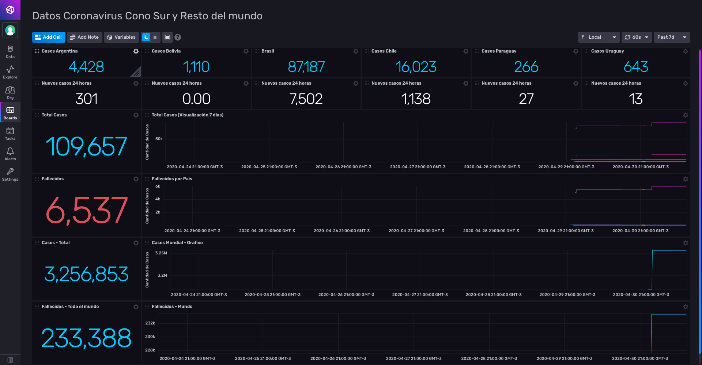

# COVID-19 Dashboard focused in South America Data. 

Provided by: Ignacio Van Droogenbroeck

This Dashboard graph information about COVID-19 focused in Argentina, Bolivia, Brasil, Chile, Paraguay and Uruguay. Current data, new cases, graph about totals of cases and deaths. Also overall worldwide information about cases and deaths.  



### Quick Install

If you have your InfluxDB credentials [configured in the CLI](Vhttps://v2.docs.influxdata.com/v2.0/reference/cli/influx/config/), you can install this template with:

```
influx apply -u https://raw.githubusercontent.com/influxdata/community-templates/master/InfluxDBv2_Covid19_SouthAmerica/covid.yml
```

## Included Resources

    - 1 Bucket: 'covid'
    - 5 .sh files that get the information from the API and convert in JSON.
    - 1 Dashboards: covid.yml - COVID19 América del Sur y Resto del mundo
    - 1 Telegraf: 'Configuration: Exec Inputs'
    - 1 Label: 'covid'

## Setup Instructions

General instructions on using InfluxDB Templates can be found in the [use a template](../docs/use_a_template.md) document.
    
    Telegraf Configuration requires the following environment variables
    - `INFLUX_HOST` - The host running InfluxDB
    - `INFLUX_TOKEN` - The token with the permissions to read Telegraf configs and write data to the `telegraf` bucket. You can just use your operator token to get started.
    - `INFLUX_ORG` - The name of your Organization.

As the bucket was provided in this template, you need to set the following environment data </code>export INFLUX_BUCKET=covid</code>. Also may requiere adjust the information about the location of the executables files and set the agent interval to at least 1h, this for not hit to the api too much and cause service disruption. 

## Contact

Author: Ignacio Van Droogenbroeck

Email: ignacio[at]vandroogenbroeck[dot]net

Github and Gitlab user: @xe-nvdk 

Influx Slack: Ignacio Van Droogenbroeck
