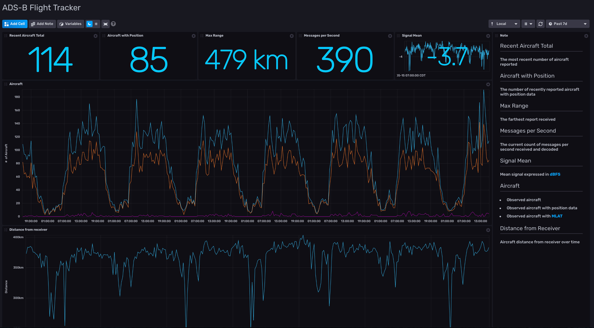

# ADS-B Aircraft Tracking Dashboard

Provided by: Tim Yocum

This dashboard will help you monitor and visualize metrics scraped from a [dump1090](https://github.com/flightaware/dump1090/) ADS-B flight tracking instance using [dump1090-exporter](https://github.com/claws/dump1090-exporter) to present a `/stats` Prometheus endpoint that can be scraped with Telegraf. While this dashboard is vendor-agnostic, it has been tested against a [PiAware](https://flightaware.com/adsb/piaware/) instance as provided by [FlightAware](https://flightware.com).



### Quick Install

#### InfluxDB or InfluxCloud UI

In the InfluxDB or InfluxCloud UI, go to Settings -> Templates and enter this URL: https://raw.githubusercontent.com/influxdata/community-templates/master/ads-b/ads-b.yml

#### Influx CLI
If you have your InfluxDB credentials [configured in the CLI](https://v2.docs.influxdata.com/v2.0/reference/cli/influx/config/), you can install this template with:

```
influx apply -u https://raw.githubusercontent.com/influxdata/community-templates/master/ads-b/ads-b.yml
```

## Included Resources

  - 1 Telegraf Configuration
  - 1 Dashboard: ADS-B Flight Tracker
  - 1 Bucket: 'ads-b'
  - 1 Label: 'ADS-B'

## Setup Instructions

General instructions on using InfluxDB Templates can be found in the [use a template](../docs/use_a_template.md) document.

Telegraf Configuration requires the following environment variables
  - `INFLUX_TOKEN` - The token with the permissions to read Telegraf configs and write data to the `ads-b` bucket.
  - `INFLUX_ORG` - The name of your Organization.
  - `INFLUX_HOST` - The address of your InfluxDB or InfluxCloud instance.
  - `INFLUX_BUCKET` - The name of the bucket. Example using the provided bucket: ```export INFLUX_BUCKET=ads-b```

## Contact

Author: Tim Yocum

Email: tky[at]influxdata[dot]com

GitHub: @tkyocum

Influx Slack: Tim Yocum
