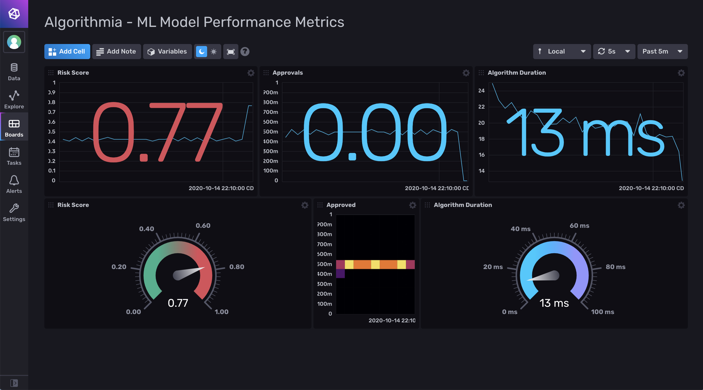

# Algorithmia

Provided by: [Algorithmia](https://algorithmia.com/)

Algorithmia is an MLOps platform that includes capabilities for data scientists,
application developers, and IT operators to deploy, manage, govern, and secure
machine learning and other probabilistic models in production.

Algorithmia Insights is a feature of Algorithmia Enterprise and provides a
metrics pipeline that can be used to instrument, measure, and monitor your
machine learning models.



This template allows you to stream operational metrics and user-defined,
inference-related metrics from Algorithmia to InfluxDB using Telegraf and Kafka.

### Quick Install

#### InfluxDB UI

In the InfluxDB UI, go to Settings->Templates and enter this URL:
https://raw.githubusercontent.com/influxdata/community-templates/master/algorithmia/algorithmia.yml

#### Influx CLI

If you have your InfluxDB credentials [configured in the
CLI](https://v2.docs.influxdata.com/v2.0/reference/cli/influx/config/), you can
install this template with:

```
influx apply -u https://raw.githubusercontent.com/influxdata/community-templates/master/algorithmia/algorithmia.yml
```

## Included Resources

This template includes the following:

  - 1 Bucket: `insights`
  - 1 Dashboard: `Algorithmia - ML Model Performance Metrics`
  - 1 Telegraf configuration

## Setup Instructions

This template allows you to monitor and visualize metrics from Algorithmia when
a model that has Insights enabled is queried. Each JSON payload from Algorithmia
includes operational metrics and inference-related metrics that can be analyzed
in InfluxDB.

1. From your Algorithmia instance, configure Algorithmia Insights to connect to
   a Kafka broker and specify a Kafka topic.
2. Start Telegraf using the configuration included in this template.
3. In Algorithmia, instrument your algorithm and publish a version that has
   Insights enabled.
4. When your model is queried in Algorithmia, it will send metrics to InfluxDB
  where you can monitor and visualize relevant model performance metrics.

The Telegraf configuration requires the following environment variables to be
defined:

  - `INFLUX_HOST` - The URL for your InfluxDB host.

  - `INFLUX_TOKEN` - The token with the permissions to read Telegraf configs and
    write data to the `telegraf` bucket. You can use your operator token to get
    started.

  - `INFLUX_ORG` - The name of your organization in InfluxDB.

  - `KAFKA_BROKER` - The URL for your Kafka broker.

  - `KAFKA_TOPIC` - The Kafka topic that Algorithmia Insights is configured to
    use.

You **MUST** set these environment variables before running Telegraf using
something similar to the following commands:

  - This is the URL for your InfluxDB host should be in the format:
  - `export INFLUX_HOST=http://1.2.3.4:8086/`

  - This can be found on the `Load Data` > `Tokens` page in your browser:
  - `export INFLUX_TOKEN=TOKEN`

  - Your organization name can be found on the Settings page in your browser:
  - `export INFLUX_ORG=my_org`

  - This is the URL for your Kafka broker and should be in the format:
  - `export KAFKA_BROKER=1.2.3.4:9092`

  - The Kafka topic should be the same topic that you configured in Algorithmia:
  - `export KAFKA_TOPIC=insights`

## Customizations

Note that this dashboard uses the `duration_milliseconds` metric, which is one
of the operational metrics that is included in the default JSON payload from
Algorithmia. The other metrics used in the dashboard (`risk_score` and
`approved`) were defined by the algorithm developer and will be different
depending on your particular algorithm and use case.

Additional metrics can include any user-defined, inference-related metrics that
are specified in Algorithmia by the algorithm developer then analyzed in
InfluxDB.

## Contact

Author: Kristopher Overholt, https://algorithmia.com/

Github: @koverholt
