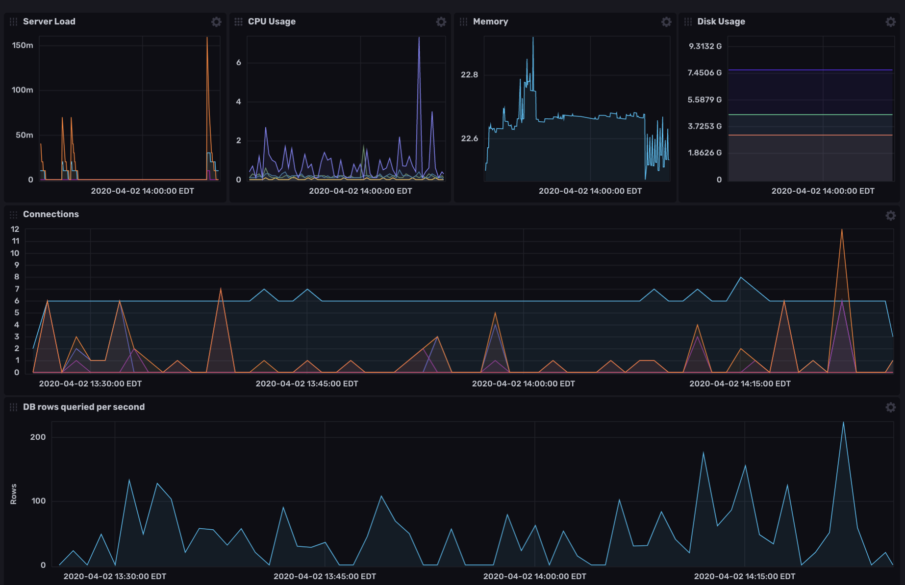
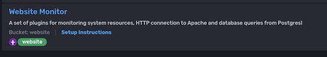
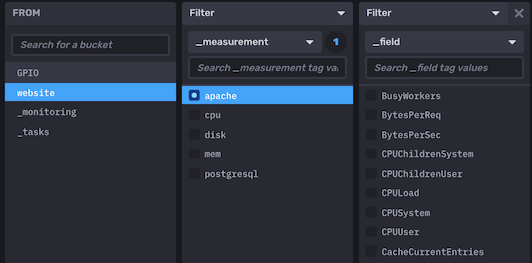

## Apache and Postgresql Monitoring Template

This InfluxDB Template can be used to monitor a website running on Apache HTTPd and Postgresql



### Quick Install

If you have your InfluxDB credentials [configured in the CLI](Vhttps://v2.docs.influxdata.com/v2.0/reference/cli/influx/config/), you can install this template with:

```
influx apply -u https://raw.githubusercontent.com/influxdata/community-templates/master/apache_postgresql/website_template.yml
```

### Included Resources

- `Website Monitoring` Dashboard (see screenshot above)
- `Website Monitor` Telegraf configuration
- Variables for `hostname` and `database`
- Alert for `High Server Load`
- Bucket named `website` for all measurements
- Label `website` applied to all resources


## Setup Instructions

General instructions on using InfluxDB Templates can be found in the [use a template](../docs/use_a_template.md) document.

### Apache

In order to collect information from your Apache server, you will need to add the `mod_status` module for your site by adding the following section to your site configuration:

 ```
    <Location "/server-status">
        SetHandler server-status
        Require ip YOUR.TELEGRAF.HOST.IP
    </Location>
```

> Be sure to replace `YOUR.TELEGRAF.HOST.IP` with the IP address of the host where you're running Telegraf from, so it can access the server status page. See the [mod_status](https://httpd.apache.org/docs/2.4/mod/mod_status.html) documentation for more information on configuring this Apache module.

### Telegraf    
  The data for the dashboard is populated by the included Telegraf configuration. The Telegraf Configuration requires the following environment variables
    
  - `INFLUX_TOKEN` - The token with the permissions to read Telegraf configs and write data to the `telegraf` bucket. You can just use your operator token to get started.
  - `INFLUX_ORG` - The name of your Organization (this will be your email address on the InfluxDB Cloud free tier)
  - `INFLUX_HOST` - The URL of your InfluxDB host (this can your localhost, a remote instance, or InfluxDB Cloud)
  - `APACHE_HOSTNAME` - The website name, will be used for the `host` tag in measurements
  - `APACHE_STATUS_URL` - The URL where your Apache `server-status` is located
  - `PG_HOST` - The hostname of your Postgresql database
  - `PG_USER` - The user account to authenticate to your Postgresql database
  - `PG_PASSWD` - The password to authenticate to your Postgresql database

  You **MUST** set these environment variables before running Telegraf using something similar to the following commands
    
  - This can be found on the `Load Data` > `Tokens` page in your browser: `export INFLUX_TOKEN=TOKEN`
  - Your Organization name can be found on the Settings page in your browser: `export INFLUX_ORG=my_org`

## Running Telegraf

  To get resource data from your Linux hosts, [download and install Telegraf](https://portal.influxdata.com/downloads/) on those hosts. InfluxData provides native packages for a number of distributions as well as binaries that can be executed directly.

  Start Telegraf using the instructions from the `Load Data` > `Telegraf` > `Setup Instructions` link in the UI.



## Customizations

The Apache and Postgresql plugins for Telegraf provide measurements data from many fields, but the dashboard for this template only provides the most commonly useful. You might be interested in some specific data, such as DB rows written, or number of bytes served by Apache. Use the Data Explorer tab in InfluxDB to try out different fields and queries.



## Contact

- Author: Michael Hall
- Email: mhall@influxdata.com
- Github: [@mhall119](https://github.com/mhall119)
- Influx Slack: [@Michael Hall](https://influxdata.com/slack)