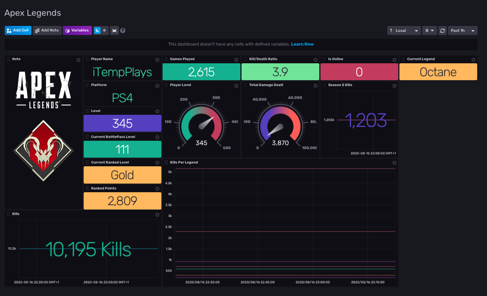
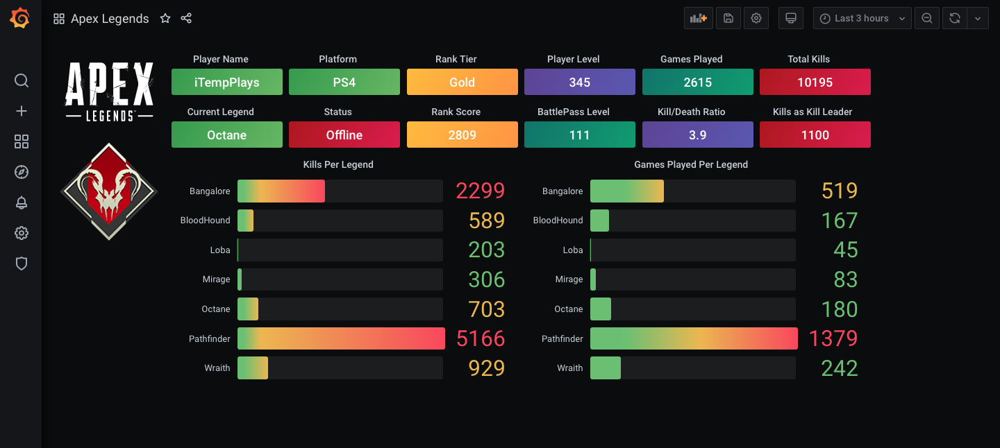

# Apex Legends

Provided by: Grant Bevis

Here's a Telegraf & InfluxDB template/config to pull JSON API data from [MozambiqueHe.re](https://mozambiquehe.re) and process it into InfluxDB.





Stats are that of a fantastic YouTuber [iTemp Plays](https://www.youtube.com/user/iTemp2)

### Quick Install

If you have your InfluxDB credentials [configured in the CLI](Vhttps://v2.docs.influxdata.com/v2.0/reference/cli/influx/config/), you can install this template with:

```
influx apply -u https://raw.githubusercontent.com/influxdata/community-templates/master/apex_legends/apex_legends_template.yml
```

## Included Resources

    - 1 Bucket: apexlegends
    - 2 Dashboards: Apex Legends for InfluxDB 2 and for Grafana
    - 1 Label: Game Data

## Setup Instructions

General instructions on using InfluxDB Templates can be found in the [use a template](../docs/use_a_template.md) document.

You will need to sign up for your own API key here: [https://apexlegendsapi.com](https://apexlegendsapi.com)

Once you're in posession of your own API key you will need to craft your own API request e.g

`https://api.mozambiquehe.re/bridge?version=4&platform=<PLATFORM>&player=<PLAYERNAME>&auth=<YOUR API KEY>`

`<PLATFORM>` - PC, X1 or PS4
`<PLAYERNAME>` - Your username for Apex Legends
`<YOUR API KEY>` - Your API Key from signing up

e.g

`https://api.mozambiquehe.re/bridge?version=4&platform=PS4&player=iTempPlays&auth=xxxxxxxxxxxxxxxxxxxx`

Due to limitations on the API and the way Telegraf processes the JSON data it's more efficient to have a cronjob curl the API every 5 minutes and output to a local file and then have Telegraf's `[[inputs.file]]` pick up the data. On *nix add the following to your crontab using `crontab -e`

`*/5 * * * * curl "https://api.mozambiquehe.re/bridge?version=4&platform=PS4&player=iTempPlays&auth=xxxxxxxxxxxxxxxxxxxx" > /etc/telegraf/apex_legends.json`

This will run curl every 5 minutes to pull the stats from the API endpoint and write them to `/etc/telegraf/apex_legends.json` - This can be anywhere your Telegraf instance can read from.
    
    Telegraf Configuration requires the following environment variables
    - `INFLUX_HOST` - The URL for your InfluxDB instance.
    - `INFLUX_TOKEN` - The token with the permissions to read Telegraf configs and write data to the `telegraf` bucket. You can just use your operator token to get started.
    - `INFLUX_ORG` - The name of your Organization
    You **MUST** set these environment variables before running Telegraf using something similar to the following commands
    - This can be found on the `Load Data` > `Tokens` page in your browser: `export INFLUX_TOKEN=TOKEN`
    - Your Organization name can be found on the Settings page in your browser: `export INFLUX_ORG=my_org`

## Contact

Author: b3vis

Github: [@bevis](https://github.com/b3vis)

Influx Slack: @b3vis
