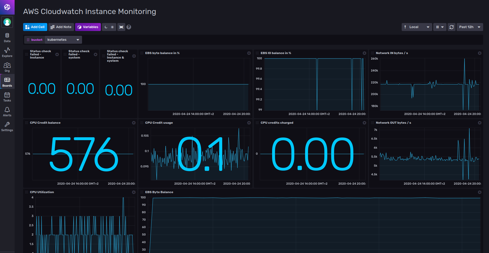
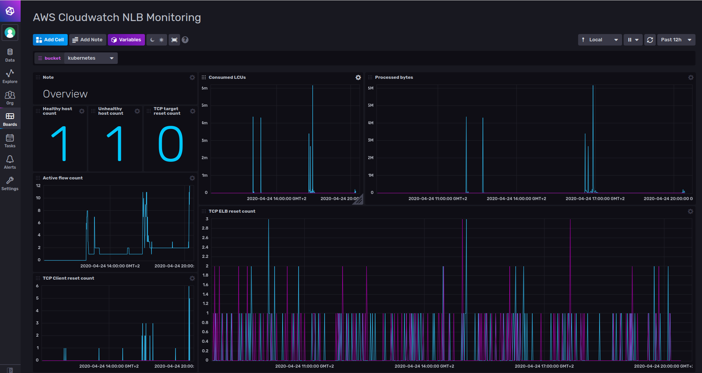

# AWS Cloudwatch Monitoring Template

Provided by: [bonitoo.io](.)

**Display data from AWS EC2 andn ELB using the AWS CloudWatch Service.**

1. The AWS CloudWatch Network Load Balancers monitoring dashboard displays data from `cloudwatch_aws_network_elb` measurement.
2. The AWS CloudWatch Instance Monitoring dashboard displays data from the `cloudwatch_aws_ec2` measurement.

##### Dashboard examples

## Included Resources

This template includes the following:

- 2 Labels: `inputs.cloudwatch`, `AWS`
- 2 Dashboards: `AWS Cloudwatch Instance Monitoring`, `AWS CloudWatch NLB Monitoring`
- 1 Variable: `bucket`

## Setup Instructions

Load the dashboards and use the [Telegraf CloudWatch plugin](https://github.com/influxdata/telegraf/tree/master/plugins/inputs/cloudwatch) into your
environment.

Include the Telegraf Cloudwatch plugin in your Telegraf configuration and start Telegraf.

Visit the dashboard and use the `v.bucket` variable to select which bucket the data is stored in.

## Customizations

n/a

## Contact

Author: Ivan Kudibal, Tomas Klapka, https://www.bonitoo.io

Github: @ivankudibal
