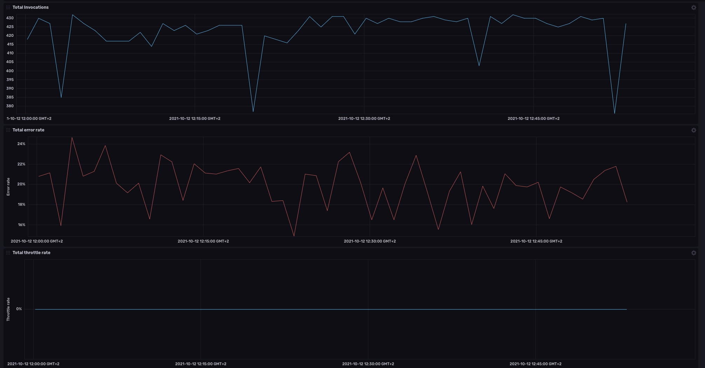
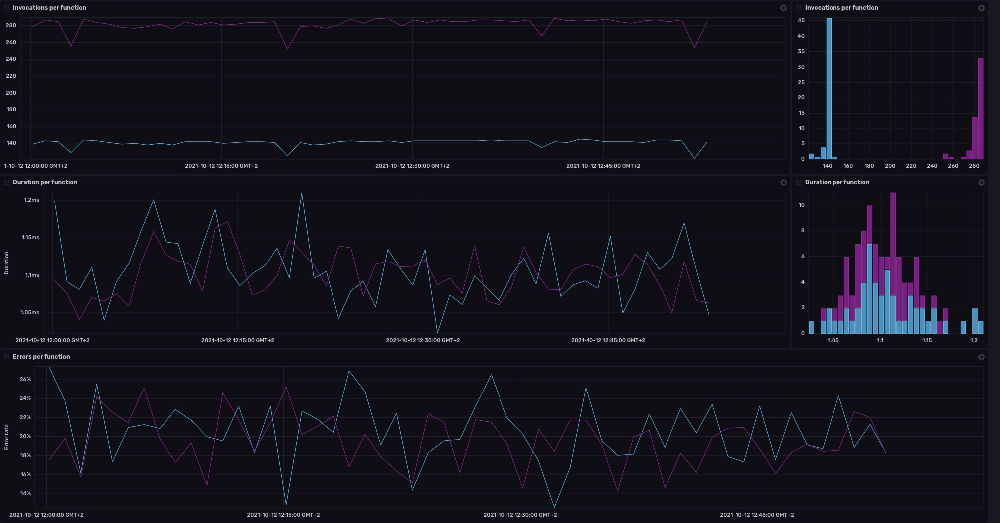

# AWS Lambda Template

Provided by: [bonitoo.io](.)

**This template provides AWS Lambda dashboard**

> AWS Lambda is a serverless compute service that lets you run code without provisioning or managing servers, creating workload-aware cluster scaling logic, ...

Monitor your Lambda functions with beautiful InfluDB dashboards.




Lambda metrics available in this dashboard:

- **Invocation count**
- **Error statistics**
- **Throttle statistics**

### Quick Install

#### InfluxDB UI

In the InfluxDB UI, go to Settings->Templates and enter this URL: https://raw.githubusercontent.com/influxdata/community-templates/master/aws_lambda/lambda.yml

#### Influx CLI

If you have your InfluxDB credentials [configured in the CLI](https://v2.docs.influxdata.com/v2.0/reference/cli/influx/config/), you can install this template with:

```
influx apply -u https://raw.githubusercontent.com/influxdata/community-templates/master/aws_lambda/lambda.yml
```

## Included Resources

The template consists of the following:

- 1 Dashboard: `AWS Lambda`
- 1 Variable: `bucket`

## Setup Instructions

General instructions on using InfluxDB Templates can be found in the [use a template](../docs/use_a_template.md) document.

**Import the template**

```
influx apply --file ./lambda.yml
```

**Start with a sample data:**

> To generate sample data you need to create a lambda function and configure Telegraf.

**To generate** sample data, follow these steps:

1. Create a lambda function(s) in you AWS account. You can use simple function from `./sample/lambda.js`.
1. Install InfluxDB 2.x on your localhost or sign up to Influx Cloud
1. Configure Telegraf. Use `AWS/Lambda` as namespace. See https://github.com/influxdata/telegraf/tree/master/plugins/inputs/cloudwatch for details.
1. Run `./sample/requests.sh <lambda_url>` to generate some traffic.

After some delay the dashboard should start presenting the results.

## Customizations

n/a

## Contact

Author: Tomas Vojtech, https://www.bonitoo.io

Github: @tvojtech
