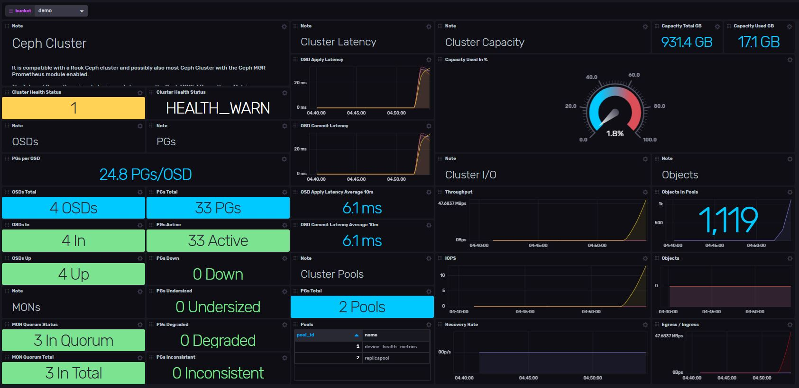

# Ceph Cluster Template

Provided by: @bonitoo.io

Ceph is a free-software storage platform, implements object storage on a single distributed computer cluster, and provides interfaces for object-, block- and file-level storage. Ceph aims primarily for completely distributed operation without a single point of failure, and freely available.

This InfluxDB template can be used to monitor your Ceph Cluster system. It uses Telegraf Prometheus input plugin to scrape Prometheus metrics from Ceph's MGR service endpoint. 
> It is compatible with a Rook Ceph cluster and possibly also most Ceph Cluster with the Ceph MGR Prometheus module enabled.



### Quick Install

#### InfluxDB UI

In the InfluxDB UI, go to Settings->Templates and enter this URL: https://raw.githubusercontent.com/influxdata/community-templates/master/ceph/ceph-cluster-overview.yml

#### Influx CLI
If you have your InfluxDB credentials [configured in the CLI](https://v2.docs.influxdata.com/v2.0/reference/cli/influx/config/), you can install this template with:

```
influx apply -u https://raw.githubusercontent.com/influxdata/community-templates/master/ceph/ceph-cluster.yml
```

## Included Resources

  - 2 Labels: `ceph`,`inputs.prometheus`
  - 1 Telegraf Configuration
  - 1 Dashboard: `Ceph Cluster`
  - 1 Variable: `bucket`

## Setup Instructions

General instructions on using InfluxDB Templates can be found in the [use a template](../docs/use_a_template.md) document.

### Requirements:

#### Ceph Cluster:

It is compatible with a [Rook Ceph cluster](https://rook.io/docs/rook/v1.5/) running in Kubernetes and possibly also most Ceph Cluster with the Ceph MGR [Prometheus module enabled](https://rook.io/docs/rook/v1.5/ceph-monitoring.html).

#### Telegraf:

The Telegraf Prometheus input plugin needs to scrape the Ceph MGR(s) Prometheus Metrics Endpoint(s).
    
Telegraf configuration requires the following environment variables
  - `INFLUX_HOST`
  - `INFLUX_BUCKET`
  - `INFLUX_TOKEN` - The token with the permissions to read Telegraf configs and write data to the `telegraf` bucket. You can just use your operator token to get started.
  - `INFLUX_ORG` - The name of your Organization
  - `CEPH_MGR_SVC_URLS` - URLs to Ceph Manager metrics endpoint service(s) e.g. `http://rook-ceph-mgr.rook-ceph.svc.cluster.local:9283/metrics`. 

Any configuration changes reflecting your specific Kubernetes or Ceph installation can be set in the Telegraf configuration manually.  

You **MUST** set these environment variables before running Telegraf using something similar to the following commands
  - This can be found on the `Load Data` > `Tokens` page in your browser: `export INFLUX_TOKEN=TOKEN`
  - Your Organization name can be found on the Settings page in your browser: `export INFLUX_ORG=my_org`

## Contact

Author: Tomas Klapka, Bonitoo s.r.o.

Github: Bonitoo.io