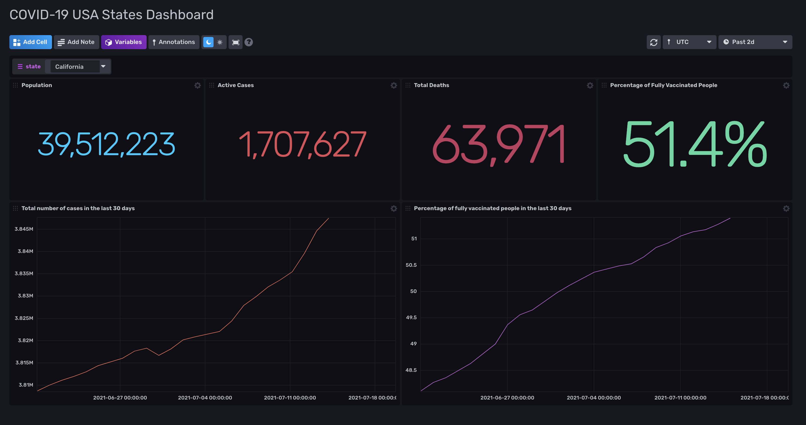
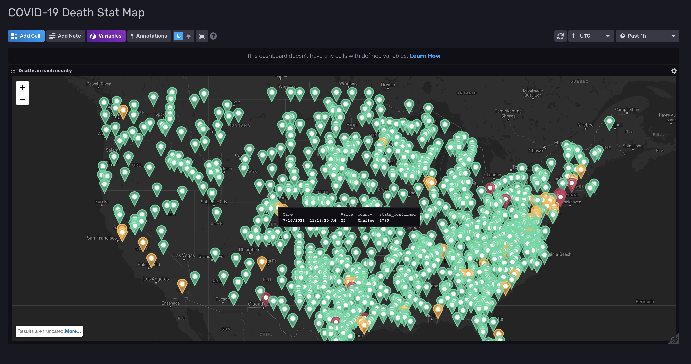
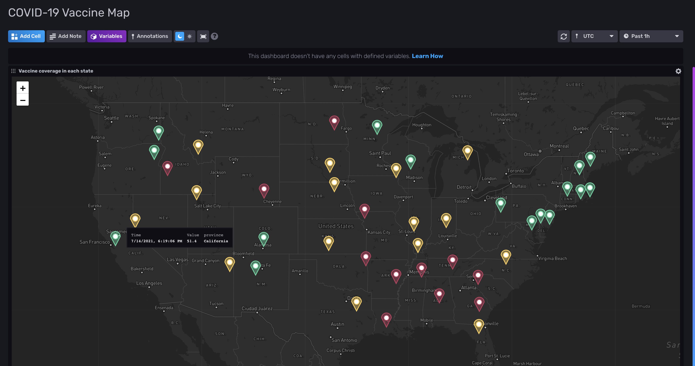

# COVID-19 and Vaccination Statistics for The USA States

Provided by: Sara Ghodsi

This template consists of three dashboards that present statistics on COVID-19 cases and vaccination rates. It shows graphs for statistics for the last 30 days along with maps of the United States with pins for each state or county.





### Quick Install

#### InfluxDB UI

In the InfluxDB UI, go to Settings->Templates and enter this URL: https://raw.githubusercontent.com/influxdata/community-templates/master/covid19-usa-states/covid-template.yml

#### Influx CLI
If you have your InfluxDB credentials [configured in the CLI](https://v2.docs.influxdata.com/v2.0/reference/cli/influx/config/), you can install this template with:

```
influx apply -u https://raw.githubusercontent.com/influxdata/community-templates/master/covid19-usa-states/covid-template.yml
```

## Included Resources

  - 1 Bucket: `covid`
  - 4 Telegraf Configurations (located in `telegraf-configs`)
  - 3 Dashboards: `COVID-19 USA States Dashboard`, `COVID-19 Death Stat Map`, and `COVID-19 Vaccine Map`
  - 1 Variables: `state`

## Setup Instructions

General instructions on using InfluxDB Templates can be found in the [use a template](../docs/use_a_template.md) document.
    
Telegraf Configuration requires the following environment variables
  - `INFLUX_HOST` - The host running InfluxDB.
  - `INFLUX_TOKEN` - The token with the permissions to read Telegraf configs and write data to the `covid` bucket. You can just use your operator token to get started.
  - `INFLUX_ORG` - The name of your Organization.


## Contact

Author: Sara Ghodsi 
> This project was done as part of the summer 2021 intern hackathon with Bar Weiner, Beth Legesse, Brandii Warden, and Alex Krantz

Email: sara.ghodsi@gmail.com

Github: @saraghds

Influx Slack: @Sara Ghodsi