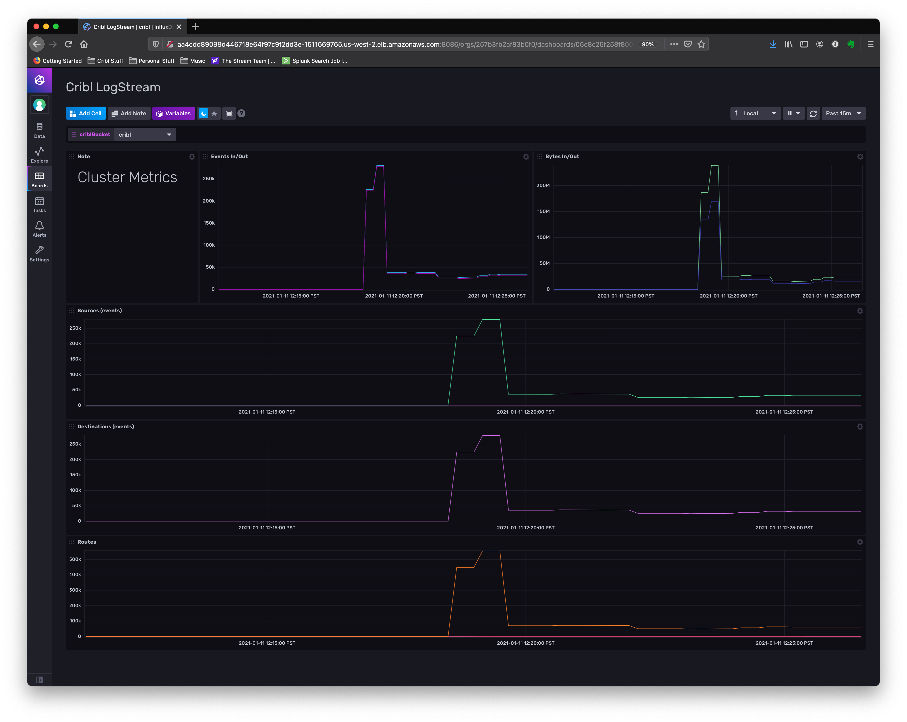

# Cribl LogStream
This InfluxDB Template can be used to monitor Cribl LogStream

## Quick Install

### InfluxDB UI
In the InfluxDB UI, go to Settings -> Templates and enter this URL: https://raw.githubusercontent.com/influxdb/community-templates/master/cribl/logstream-template.yml

### Influx CLI

If you have your InfluxDB credentials conrigured in the CLI, you can isntall this template with: 

> influx apply -f https://raw.githubusercontent.com/influxdb/community-templates/master/cribl/logstream-template.yml

## Requirements
- Set environemnt variables on host/s from which Cribl LogStream will be sending metrics. These are:

## Setup Instructions
---
Once installed,, you'll need to setup Cribl LogStream to send the internal metrics to your influx DB deployment.

## Pre-Work

## Schema

## Measurements

## Contact
- Author: Clint Sharp
- Email: clint@cribl.io
- Github: criblio
- Influx Slack: @Clint Sharp
