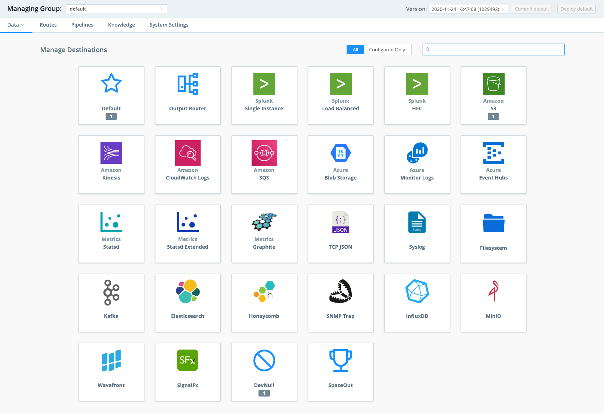
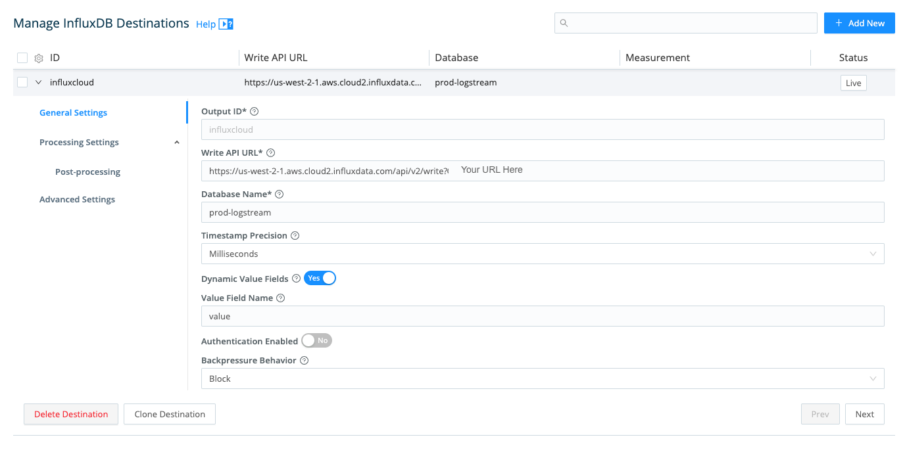
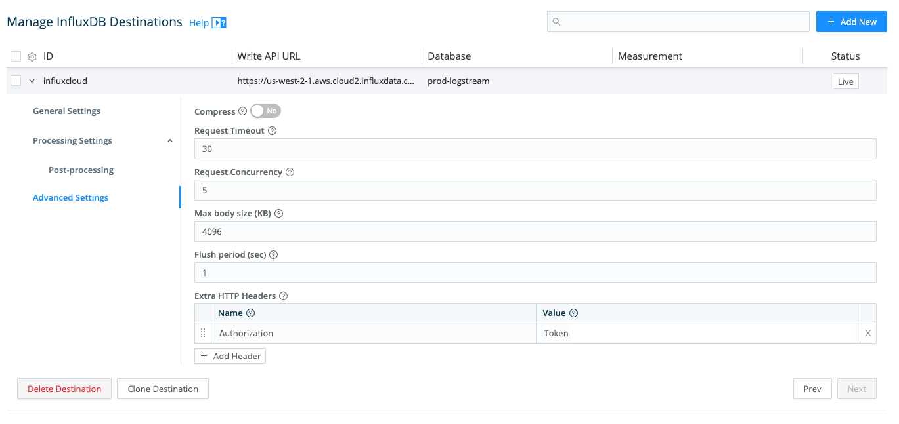
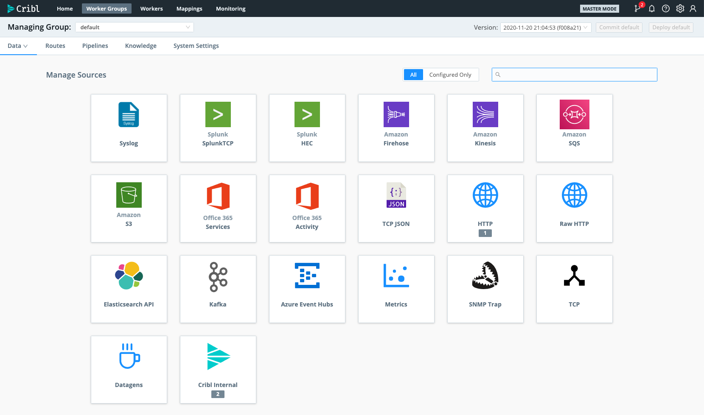

# Cribl LogStream
Provided by [Cribl](https://cribl.io) 

This InfluxDB Template can be used to see the metrics created by your Cribl LogStream deployment. 

## Quick Install

### InfluxDB UI
In the InfluxDB UI, go to Settings -> Templates and enter this URL: https://raw.githubusercontent.com/influxdb/community-templates/master/criblio_logstream/cribl_logstream.yml

### Influx CLI

If you have your InfluxDB credentials conrigured in the CLI, you can isntall this template with: 

`influx apply -f https://raw.githubusercontent.com/influxdb/community-templates/master/criblio_logstream/cribl_logstream.yml`

## Included Resources
- 1 Dashboard: Cribl LogStream
- 1 bucket: 'criblBucket'

## Setup Instructions

General instructions on using InfluxDB [Templates](https://github.com/influxdata/community-templates/blob/master/docs/use_a_template.md) can be found in the use a template document.

Log Into your Cribl LogStream master node and configure your InfluxDB Destination:

- Set environemnt variables on for the InfluxDB Destination: 

 

- `Write API URL` - Your InfluxDB Cloud Endpoint, here's an example:  `https://us-west-2-1.aws.cloud2.influxdata.com/api/v2/write?org=<your_org_id>&bucket=criblLogstream&precision=ms` 
- `Database Name` - Your InfluxDB Name: `criblBucket`
- `Extra HTTP Headers` - Navigate to Advanced Settings and add the `Authorization` Header with your `Token` as the value.

 

## Pre-Work
To start sending Cribl metrics with the template-provided configuration, you need to setup the following:
Click on Sources and select the Cribl Internal Icon:

Once installed, you'll need to setup Cribl LogStream to send the internal metrics to your influx DB deployment. Check out the Cribl LogStream docs on how to send your [Cribl Internal metrics](https://docs.cribl.io/docs/sources-cribl-internal) to the [InfluxDB destination](https://docs.cribl.io/docs/destinations-influxdb). 

## Contact
- Author: Clint Sharp
- Email: clint@cribl.io
- Github: criblio
- Influx Slack: @Clint Sharp
