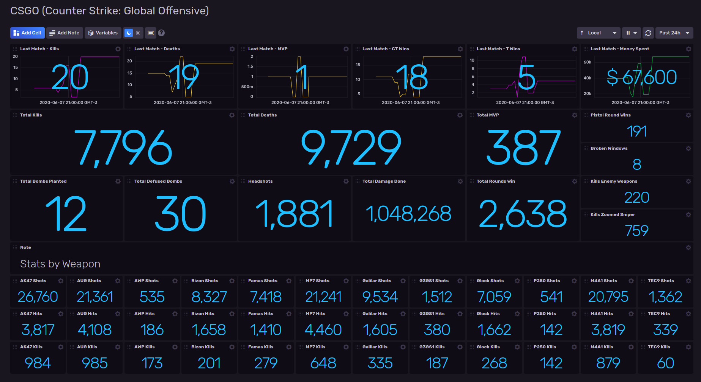

# Counter Strike Global Offensive (CSGO) Template for InfluxDB v2

Provided by: Ignacio Van Droogenbroeck

This Dashboard offers you information about your game in CSGO. Information about Last Match and general data, like, Kills, Death, MVP's, Total Damage Stats by weapon and more.



### Quick Install

If you have your InfluxDB credentials [configured in the CLI](Vhttps://v2.docs.influxdata.com/v2.0/reference/cli/influx/config/), you can install this template with:

```
influx pkg -u https://raw.githubusercontent.com/influxdata/community-templates/master/csgo/csgo.yml
```

## Included Resources

    - 1 Telegraf Configuration: 'csgo-telegraf'
    - 1 Dashboards
    - 1 Label: 'csgo'
    - 1 Bucket: 'csgo'
    - 1 Executable: 'csgo.sh'

## Setup Instructions

General instructions on using InfluxDB Templates can be found in the [use a template](../docs/use_a_template.md) document.
    
    Telegraf Configuration requires the following environment variables
    - `INFLUX_TOKEN` - The token with the permissions to read Telegraf configs and write data to the `telegraf` bucket. You can just use your master token to get started.
    - `INFLUX_ORG` - The name of your Organization.
    - `INFLUX_HOST` - The address of you InfluxDB
    - `INFLUX_BUCKET` - The name of the Bucket. If you going to use the bucket included, you need to export the variable. Ex: <code>INFLUX_BUCKET=mssql</code>

In order to use this dashboard you need to get an API key and your Steam User ID:

- https://steamcommunity.com/dev/apikey
- https://steamidfinder.com/

After you got this data, you need to edit the csgo.sh file with the API Key and Steam User ID.

## Contact

Author: Ignacio Van Droogenbroeck

Email: ignacio[at]vandroogenbroeck[dot]net

Github and Gitlab user: @xe-nvdk 

Influx Slack: Ignacio Van Droogenbroeck
