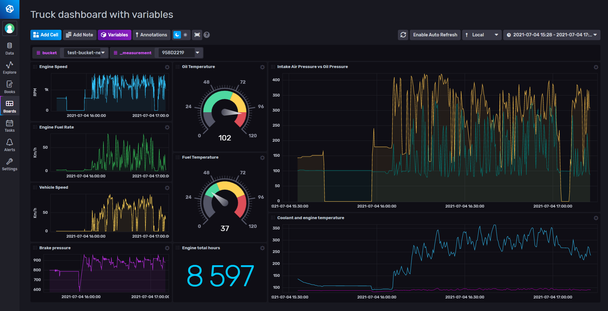

# CSS Electronics Template

Provided by: [bonitoo.io](.)

This template provides a dashboard for [CSS electronics](https://www.csselectronics.com/) data example.

### Dashboard example



### Quick Install

#### InfluxDB UI

In the InfluxDB UI, go to Settings->Templates and enter this URL: https://github.com/influxdata/community-templates/tree/master/css_electronics/css_electronics.yml

#### Influx CLI

If you have your InfluxDB credentials [configured in the CLI](https://v2.docs.influxdata.com/v2.0/reference/cli/influx/config/), you can install this template with:

```
influx apply https://github.com/influxdata/community-templates/tree/master/css_electronics/css_electronics.yml
```

## Included Resources

This template includes the following:

  - 1 bucket `test-bucket-new`
  - 1 dashboard `Truck dashboard with variables`
  - 2 variable `bucket` `_measurement`


## Setup Instructions

1. Load the dashboard according to the the paragraph above

## Contact

Author: Roman Wehmhőner, https://www.bonitoo.io
