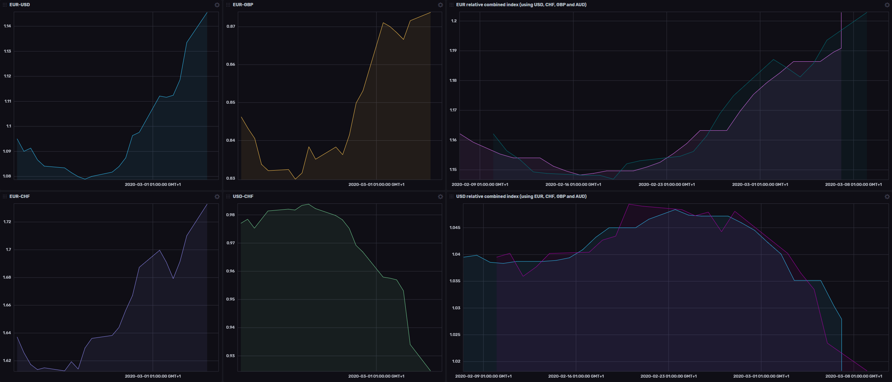

# Currency Exchange Rates Sample Template

Provided by: InfluxData

Uses [www.quandl.com](https://www.quandl.com/) for retrieving of data. It requires a free API key to use.

This InfluxDB Template can be used to analyze and monitor exchange rates and build indexes.

The included dashboard retrieves daily indexes from [European Central Bank](https://www.quandl.com/data/ECB-European-Central-Bank) data source.

The dashboard includes 4 sample exchange rates:
- EUR-USD
- EUR-GBP
- EUR-CHR
- USD-CHR

The goal of the template is to show how easy it is to use InfluxDB and Telegraf to retrieve time-series data from any source, add it to InfluxDB and be able to process it.

It also shows how to use functions such as [timedMovingAverage()](https://v2.docs.influxdata.com/v2.0/reference/flux/stdlib/built-in/transformations/aggregates/timedmovingaverage/) to perform basic analysis.

## Included Resources

  - 1 Bucket: `quandl`, 30d retention
  - 2 Labels: `Exchange Rates`, `outputs.influxdb_v2`
  - 1 Telegraf Configuration: `Exchange Rates Data Retrieval.conf`
  - 1 Dashboards: `Exchange Rates`
  - 1 Variables: `bucket`

## Setup Instructions
    
  The data for the dashboard is populated by the included Telegraf configuration. The Telegraf Configuration requires the following environment variables
    
  - `INFLUX_TOKEN` - The token with the permissions to read Telegraf configs and write data to the `telegraf` bucket. You can just use your master token to get started.
  - `INFLUX_ORG` - The name of your Organization
  - `INFLUX_HOST` - The URL of your InfluxDB host (this can your localhost, a remote instance, or InfluxDB Cloud)
  - `QUANDL_API_KEY` - The API key fro quandl

  You **MUST** set these environment variables before running Telegraf using something similar to the following commands
    
  - This can be found on the `Load Data` > `Tokens` page in your browser: `export INFLUX_TOKEN=TOKEN`
  - Your Organization name can be found on the Settings page in your browser: `export INFLUX_ORG=my_org`
  - Quandl API key can be retrieved from [Your Profile](https://www.quandl.com/account/profile) page

  You can start Telegraf using the instructions from the `Telegraf` > `Setup Instructions` link in the UI.

## Contact

- Author: Wojciech Kocjan
- Email: wkocjan@influxdata.com
- Github: [@wojciechka](https://github.com/wojciechka)
- Influx Slack: [@wojciechka](https://influxdata.com/slack)
