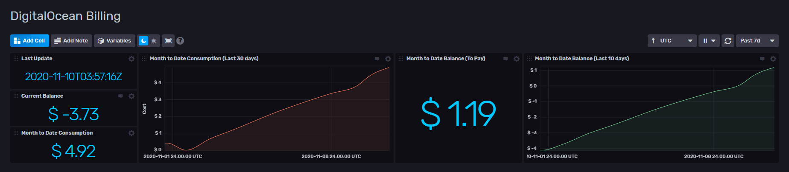

# DigitalOcean Billing Dashboard for InfluxDB v2

Provided by: Ignacio Van Droogenbroeck

This Dashboard offers you information your balance, consumption to date and balance to date of your DigitalOcean Account.



### Quick Install

#### InfluxDB UI

In the InfluxDB UI, go to Settings->Templates and enter this URL: https://raw.githubusercontent.com/influxdata/community-templates/master/do_billing/dobilling.yml

#### Influx CLI
If you have your InfluxDB credentials [configured in the CLI](https://v2.docs.influxdata.com/v2.0/reference/cli/influx/config/), you can install this template with:

```
influx apply -u https://raw.githubusercontent.com/influxdata/community-templates/master/do_billing/dobilling.yml
```

## Included Resources

  - 1 Telegraf Configuration: 'dobilling'
  - 1 Dashboards: 'DigitalOcean Billing'
  - 1 Label: 'digitalocean'
  - 1 Bucket: 'do_billing'
  - 1 sh file: balance.sh

## Setup Instructions

General instructions on using InfluxDB Templates can be found in the [use a template](../docs/use_a_template.md) document.

Telegraf Configuration requires the following environment variables
  - `INFLUX_TOKEN` - The token with the permissions to read Telegraf configs and write data to the `telegraf` bucket. You can just use your operator token to get started.
  - `INFLUX_ORG` - The name of your Organization.
  - `INFLUX_HOST` - The address of you InfluxDB

To use this dashboard, you need a DigitalOcean Token. Read Only is sufficient and you can get one [from here](https://cloud.digitalocean.com/account/api/tokens) and pass as to environment variable. In the balance.sh file, the variable expected is $TOKEN_DO.

The Telegraf config has set up a path to the balance.sh file the working directory from where Telegraf is running.

## Contact

Author: Ignacio Van Droogenbroeck

Email: ignacio[at]vandroogenbroeck[dot]net

Github and Gitlab user: @xe-nvdk

Influx Slack: Ignacio Van Droogenbroeck
