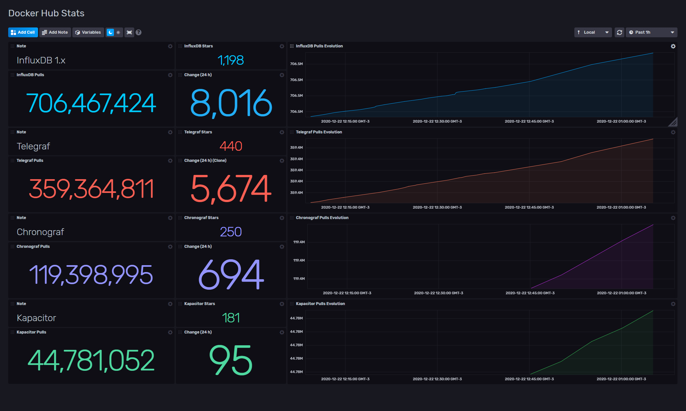

# Docker Hub Stats

Provided by: Ignacio Van Droogenbroeck

This template is going to help you to track the performance of your images in Docker Hub. Was made to track the images of InfluxData, but you can adjust it easily to track your images.

Wit this template, you can track the following:

* Total Pulls
* Stars of your image
* Change in the last 24 hours.
* Evolution of the pull in the last 30 days.



### Quick Install

#### InfluxDB UI

In the InfluxDB UI, go to Settings->Templates and enter this URL: https://raw.githubusercontent.com/influxdata/community-templates/master/dockerhub/dockerhub.yml

#### Influx CLI
If you have your InfluxDB credentials [configured in the CLI](https://v2.docs.influxdata.com/v2.0/reference/cli/influx/config/), you can install this template with:

```
influx apply -u https://raw.githubusercontent.com/influxdata/community-templates/master/dockerhub/dockerhub.yml
```

## Included Resources

  - 1 Telegraf Configuration: 'dockerhub-config'
  - 1 Dashboards: 'Docker Hub Stats'
  - 1 Label: 'dockerhub'
  - 1 Bucket: 'docker_hub'

## Setup Instructions

General instructions on using InfluxDB Templates can be found in the [use a template](../docs/use_a_template.md) document.

Telegraf Configuration requires the following environment variables
  - `INFLUX_TOKEN` - The token with the permissions to read Telegraf configs and write data to the `telegraf` bucket. You can just use your operator token to get started.
  - `INFLUX_ORG` - The name of your Organization.
  - `INFLUX_HOST` - The address of you InfluxDB

## Track your images

To track your images, you need to change the Telegraf config in the section `servers`... ex:

```
          ## URL of each server in the service's cluster
          servers = [
            "https://hub.docker.com/v2/repositories/library/influxdb/",
            "https://hub.docker.com/v2/repositories/library/telegraf",
            "https://hub.docker.com/v2/repositories/library/chronograf",
            "https://hub.docker.com/v2/repositories/library/kapacitor",
          ]
```

If you want to track an official Docker image, the URL is like: ```https://hub.docker.com/v2/repositories/library/your-image```

For organization accounts: ```https://hub.docker.com/v2/repositories/your-org/your-image```

For personal accounts: ```https://hub.docker.com/v2/repositories/your-user/your-image/```

Also, you need to adjust the dashboard changing the URLs.

## Recomendation

Be gentle with the Docker Hub API after your tests. Adjust your interval in the Telegraf config to collect stats every hour.

## Contact

Author: Ignacio Van Droogenbroeck

Email: ignacio[at]influxdata[dot]com

Github and Gitlab user: @xe-nvdk

Influx Slack: Ignacio Van Droogenbroeck
