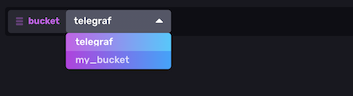
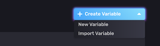

# Creating Useful Templates

InfluxDB makes it easy to export your current setup as a Template, but there's more to making a good Template than just exporting it. You want your Template to be easy to use, easy to customize, and easy to extend as well. Fortunately InfluxDB provides all the tools you need to do just that! Here are some things to consider using or including to improve the quality and usefulness of your Template.

## InfluxDB Resources

Almost any InfluxDB resource can be exported as part of a Template, how many or how few you provide is up to you. Try to strike a balance between providing a complete solution and allowing flexibility for combining it with existing resources.

### Effective Dashboards

At a minimum your Template should include a dashboard, as this is the primary way a user is going to experience your Template. Your Dashboard should provide a cohesive view of related data over a span of time. 

// TODO: Describe cell types and when to use them

Rather than using duplicate graphs to show filtered views of thes same data, use can use Variables in your graph queries (more on that below) to allow the user to easily switch between them in the same graph. Variables can be defined with a static list of values, or dynamically using Flux to query your data.

> **Tip:** If you have multiple perspectives to share on a data set, consider providing multiple dashboards rathering than trying to put everything into one. With Templates, there's no limit on how many you can provide.

### Bucket Choices

The easiest option is to provide a uniquely named bucket to be used by your Dashboard and (optional) Telegraf configurations. This simplifies things for the user, but at the expense of flexibility in reusing an existing bucket. Another thing to consider is that the InfluxDB Cloud free tier has a limit of the number of buckets a user can have, so adding a new one with your Template might not be an option for those users.

A common option in InfluxDB is to use a bucket named `telegraf` for all data coming in from the Telegraf agent. Existing users are likely to already have a bucket by this name that your Template can use. But be sure to let them know in your Template's `README.md` that they will need to create a bucket with this name if they don't already have one.

#### Reusing existing buckets
The most flexible option is to let the user choose a bucket instead. You can do this with a Variable that will provide them a drop-down list of their existing buckets to choose from. Simply create a Query Variable called `bucket` with the following Flux query:

```
buckets()
  |> filter(fn: (r) => r.name !~ /^_/)
  |> rename(columns: {name: "_value"})
  |> keep(columns: ["_value"])
```
> **Note:** the `filter()` call removes the system buckets `_monitoring` and `_tasks` from the list

Then, in your dashboard you can read from the user's chosen bucket in a cell query like this:

```
from(bucket: v.bucket) 
```

Once a Variable is used in a Dashboard, it will be shown to the user at the top of the page as a drop-down menu where they can change which value to use for that variable.



> **Tip:** If you are including a Telegraf configuration in your Template, be sure to use an environment variable such as `$INFLUX_BUCKET` so the user can define which bucket they want it to send data to.

### Using Variables

Variables are a great way to give users flexibility over your Template without them having to make any changes to it. In the previous section you saw how a Variable can be used to display a list of Buckets to use, but they can also provide static or dynamic options anywhere you use Flux. You can create a Variable fromthe `Settings` -> `Variables` page of the InfluxDB UI.



#### Static Variables

There are two ways to create a static Variable. The first is to provide a simple list of options as comma-separated values (CSV):

```
value1,value2,value3
```

The other is to provide a map of values and display names:

```
display1:value1
display2:value2
display3:value3
```

#### Variables from tags

A common use case is in InfluxDB is to filter data by one of the `tags` in the measurement. You can make this configurable in your dashboard by making a Variable out of them. Create a Query Variable with a Flux query like this one:

```
import "influxdata/influxdb/v1"
v1.measurementTagValues(bucket: "your_bucket_name", measurement: "your_measurement_name", tag: "your_tag_name")
```

This will give the user a drop-down menu with all of the unique values of the tag `your_tag_name` from the specified measurements.

#### Variables from data

// TODO: Give an example Flux query generating a Variable from field data

### Using Labels

Labels let you tag your resources for easier identification in the UI, and they will also make it easier to export them into a Template. If you have a mix of resources in your InfluxDB instance you will have to individually specify which ones to export so that you don't get them all.

However, if you create a unique label to identify those resources, you can use that when exporting so that you don't have to know the IDs of each individual resource you want to include, like this:

```
influx pkg export all --filter=labelName=your_label_name
```

## Telegraf Configurations

// TODO General advice on including Telegraf configurations in a Template

### Using Environment Variables

In order to make your configuration usable by others, certain settings inside it will need to change. Fortunately Telegraf makes this easy by looking for variables in your configuration and replacing them with environment variables. Then users can run your Telegraf configuration unmodified by simply setting those values in their environment before running it.

The main settings you'll want to replace with variables are in the `[[outputs.influxdb_v2]]` section of your configuration:

```
urls = ["$INFLUX_HOST"]

token = "$INFLUX_TOKEN"

organization = "$INFLUX_ORG"
```

If your template allows the user to choose their own `bucket` values, you should make this a variable in your configuration also:

```
bucket = "$INFLUX_BUCKET"
```

Depending on what input plugins you use, there will likely be others that you want to make variables, such as host names, databases, or authentication credentials.

> **Note:** Be sure to document all of these variables in the `README.md` for your Template so that users will know what they need to set and what values they should use.

### Telegraf Configuration Labels

Sometimes, it's handy to group Telegraf connfigurations by specific plugins. For example, if I want to make a change to an input plugin, being able to quickly find all the Telegraf configurations using that plugin is helpful. To this end, it's useful to add labels such as `inputs.plugin_name` to your Telegraf configurations to help users filter in the UI. 

### Importing into InfluxDB

// TODO: Find the easiest way to get a Telegraf config into an InfluxDB instance

## Testing Your Template

After you export your finished Template, you should always test it to make sure that it applies cleanly, has everything you wanted to include, and that the instructions your provide in your `README.md` have all the steps needed to use it.

The easiest way to get a clean testing environment of InfluxDB is to run a new Docker container. You can start a new container with the latest InfluxDB 2.0 release by running:

```
 docker run -p 8086:8086 -p 9999:9999 quay.io/influxdb/influxdb:2.0.0-bet

```

After you create a new `Organization` and `Token` in your docker instance (available at http://localhost:9999), you can follow the [instructions for using a Template](./use_a_template.md) to apply yours.
