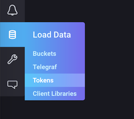
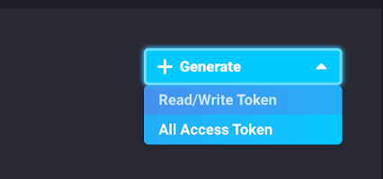

# Set up the Influx CLI

These instructions assume that you have configured your Influx CLI to use configuration profiles. For more information, please see `influx config -h` or the [InfluxDB documentation](https://v2.docs.influxdata.com/v2.0/reference/cli/influx/config/).

# Apply a template

Each template provides a manifest file and instructions for using the template.
To apply a template, use the following command:

```
 influx apply --file ~/path/to/template/manifest.yml
```

This imports the specified `manifest.yml` into an instance of InfluxDB running on `localhost`.

> Manifest files can be YAML, JSON or Jsonnet.

You can also point to a remote location, for example:
```
 influx apply --file https://raw.githubusercontent.com/influxdata/community-templates/master/template/manifest.yml
 ```

NOTE: Ensure that when pulling a file from Github, you will need to use the `raw` content link from the `Raw` button, not the URL of the file.

 ## Use Templates in InfluxDB Cloud

If you are using InfluxDB Cloud, ensure that your Influx CLI is configured with your cloud account credentials and that configuration is active. See `influx config -h` or the [InfluxDB documentation](https://v2.docs.influxdata.com/v2.0/reference/cli/influx/config/) for more details.

```
 influx apply --file ~/path/to/template/manifest.yml
```

> Your default organization name in InfluxDB Cloud will be your email address.

To apply templates and download Telegraf configurations from InfluxDB Cloud, create an **All Access Token**. You can [create this token](https://v2.docs.influxdata.com/v2.0/security/tokens/create-token/) from the `Load Data` -> `Tokens` section of the UI.




 ## Use Templates in a remote instance

If running InfluxDB on a remote server, provide the URL of your InfluxDB instance using the `--host` flag and provide your InfluxDB authentication token using the ``--token`` flag:

```
 influx apply --file ~/path/to/template/manifest.yml
```


> Need help? You can find [support](../README.md#support) information at the bottom of the main page.
