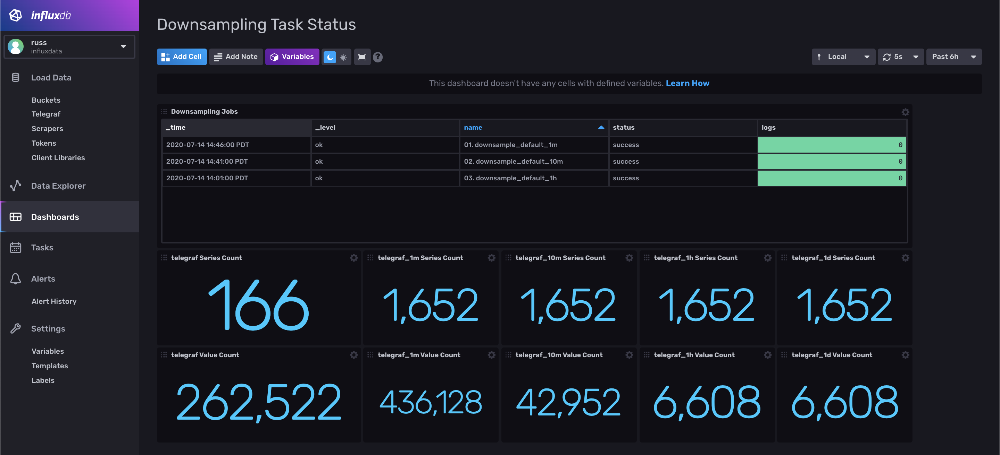

# Downsampling Template

Provided by: Russ Savage

This InfluxDB Template provides a set of Tasks that allow you to downsample your data for common Telegraf Input Plugins. It also includes a dashboard and a custom monitoring task to ensure everything is running smoothly.

### Structure

This isn't a Template that you install with a single command. Each subfolder contains a telegraf configuration as well as a set of tasks to perform downsampling on that telegraf configuration. The following assumptions have been made:

 - The bucket name for all Telegraf metrics is simply `telegraf`. If you are storing your Telegraf metrics in a different bucket, you will need to update the `fromBucket` variable at the top of each Task.
 - The naming convention for the downsampled buckets is `telegraf_<interval>`. For example, for `1h` rollups, the data is stored in `telegraf_1h`. 
 - The metrics being calculated for each field are as follows:
   - String Fields: `last`, `count`
   - Numeric Fields: `last`, `count`, `mean`, `min`, `max`, `sum`, `p99.9`, `p99`, `p95`, `p90`
 - All data is downsampled from the raw data bucket (`telegraf`) which is kept forever but can (and should) be changed. The minimum required time to keep the bucket in order to get the rollups is 24h + 5m in order to get the downsampled values.
 - The tasks are named `<num>. downsample_<plugin>_<every>`

## Included Resources

    - Downsampling Buckets: `telegraf`, `telegraf_1m`, `telegraf_10m`, `telegraf_1h`, `telegraf_1d`
    - Telegraf Configurations for each input plugin
    - 1 Dashboard: `Downsampling Status`
    - 1 Task: `00. Downsample Monitoring Task`

| Telegraf Plugin | Subdirectory |
|-----------------|--------------|
| cpu | [default_inputs](./default_inputs) |
| disk | [default_inputs](./default_inputs) |
| diskio | [default_inputs](./default_inputs) |
| internal | [internal_input](./internal_input) |
| kernel | [default_inputs](./default_inputs) |
| mem | [default_inputs](./default_inputs) |
| processes | [default_inputs](./default_inputs) |
| swap | [default_inputs](./default_inputs) |
| system | [default_inputs](./default_inputs) |

## Setup Instructions

General instructions on using InfluxDB Templates can be found in the [use a template](../docs/use_a_template.md) document.

The first thing you need to do to use the templates that are included for each of the Telegraf plugins is to set up the buckets, dashboard, and monitoring tasks. You can do that with the following command:

`./influx apply -f buckets.yml -f dashboard.yml -f monitoring_task.yml`

This will lay the foundation for the other parts of this template. Next, choose a directory for the specific Telegraf input plugin metrics you are interested in downsampling. If you don't see the plugin listed, why not add your own?

You can then add the downsampling tasks using the following command:

`./influx apply -f default_inputs/downsampling_tasks.yml`

You can also host the telegraf config if you like but it will probably be more useful to compare that to your telegraf input already configured and make any adjustments. If you do want to use the Telegraf Configs provided, you will need to set `$INFLUX_TOKEN` and `$INFLUX_ORG` env variables.

- This can be found on the `Load Data` > `Tokens` page in your browser: `export INFLUX_TOKEN=TOKEN`
- Your Organization name can be found on the Settings page in your browser: `export INFLUX_ORG=my_org`

## Contact

Author: Russ Savage

Email: russ@influxdata.com

Github: @russorat

Influx Slack: @russ