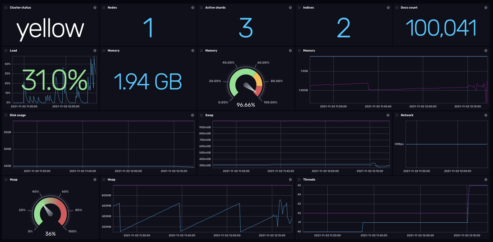

# Elasticsearch Template

Provided by: [bonitoo.io](.)

**This template provides dashboard for Elasticsearch**

> Elasticsearch is the world’s leading free and open search and analytics solution. With an emphasis on speed, scale, and relevance it's transforming how the world uses data.

With InfluxDB dashboards you can monitor your Elasticsearch's status and performance.



Elasticsearch metrics available in this dashboard:

- **System status**
- **System statistics** - CPU, memory, FS
- **JVM statistics** - heap stats, thread count

### Quick Install

#### InfluxDB UI

In the InfluxDB UI, go to Settings->Templates and enter this URL: https://raw.githubusercontent.com/influxdata/community-templates/master/elasticsearch/elasticsearch.yml

#### Influx CLI

If you have your InfluxDB credentials [configured in the CLI](https://v2.docs.influxdata.com/v2.0/reference/cli/influx/config/), you can install this template with:

```
influx apply -u https://raw.githubusercontent.com/influxdata/community-templates/master/elasticsearch/elasticsearch.yml
```

## Included Resources

The template consists of the following:

- 1 Dashboard: `Elasticsearch`
- 1 Variable: `bucket`

## Setup Instructions

General instructions on using InfluxDB Templates can be found in the [use a template](../docs/use_a_template.md) document.

**Import the template**

```
influx apply --file ./elasticsearch.yml
```

**Generate data:**

To generate data just configure just configure Telegraf to pull data from your Elastic installation and push them to InfluxDB. See https://github.com/influxdata/telegraf/blob/master/plugins/inputs/elasticsearch/README.md

The dashboard should start presenting the results.

## Customizations

n/a

## Contact

Author: Tomas Vojtech, https://www.bonitoo.io

Github: @tvojtech
