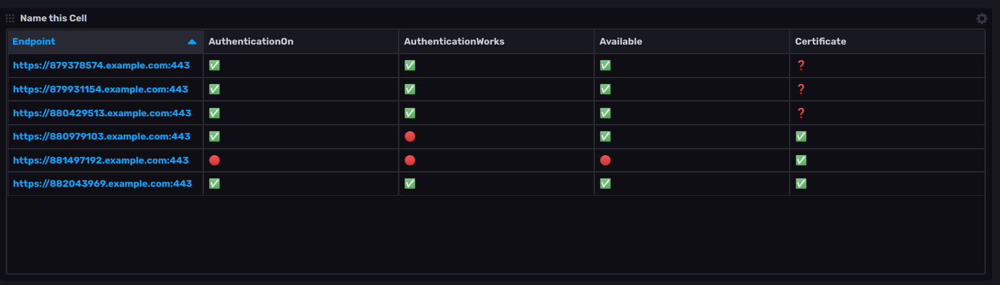

# Endpoint Security State Template

This InfluxDB template works by connecting to secure endpoints and attempting to log in. Using the `http_response` and `x509_cert` Telegraf plugins, availability, authentication, and certificate information is collected.
The dashboard displays the general availability for each endpoint along with the x509 certificate status and authentication state.



- "✅" Service is functioning as expected.
- "🟡" Service needs attention. The certificate will expire in less than 30 days.
- "🔴" Service is critical.  Endpoint is unavailable, certificate is or will expire in less than 1 day, or authentication is failing.
- "❓" We could not determine the state of the service.

## Included Resources

- 1 Bucket: `telegraf`
- 4 Labels: `outputs.influxdb_v2`, `Telegraf`, `Solution`, `security`
- 1 Telegraf Configuration 
- 4 Checks: 
    - Endpoint availablility
    - x509 Certificate status
    - Authentication is enabled
    - Authentication is working
- 1 Dashboard: `Endpoint Security State`
- 1 Variable: `bucket`

## Setup Instructions

### Install the template package
From your [InfluxDB configured CLI environment](https://v2.docs.influxdata.com/v2.0/reference/cli/influx/config/):
```
influx apply --template-url https://raw.githubusercontent.com/influxdata/community-templates/master/endpoint-security-state/endpoint-security-state.yml
```

### Customize the Telegraf configuration
Add the endpoints you would like to watch to specific input section(s).
For certificate verfification add URLs to the `sources` list in the `x509_cert` plugin configuration.
For authentication verfification, configure the `urls` list in the `http_response` plugin configurations.
`http_response` configurations without credentials will determine if an endpoint is protected by authentication requirements. Make sure the URI will not be redirected to another site for authentication if it is enabled.
`http_response` configurations with credentials will determine if we are able to login to a protected endpoint.

## Additional Uses
Here are a few more possibilities for extending this template:
- If access is still available but authentication is has been turned off, send a notification.
- Send out a notification or trigger an outside workflow when the certificate is getting close to expiration.
- Add an endpoint variable, a couple of histograms and the user can see other performance details for each endpoint.

## Contact

- Author: Darin Fisher
- Email: dfisher@influxdata.com
- Github: @darinfisher
- Influx Slack: @dfisher
