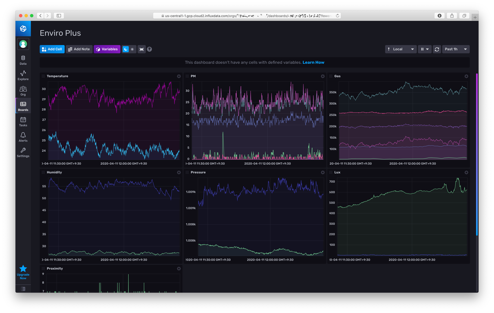

# Enviro+

Provided by: Simon Loffler

View the air quality readings from a [Pimoroni Enviro+](https://shop.pimoroni.com/products/enviro-plus) with a [PMS5003](https://shop.pimoroni.com/products/pms5003-particulate-matter-sensor-with-cable) particulate matter sensor.



## Included Resources

- 3 Labels: `air quality`,`raspberry pi`,`enviro+`
- 1 Dashboard: `Enviro Plus`

## Setup Instructions

In your [InfluxDB Cloud 2 interface](https://cloud2.influxdata.com), create a bucket named: `enviroplus`.

To export data to InfluxDB from the Enviro+, follow the installation instructions: https://github.com/sighmon/balena-enviro-plus

Note: you don't have to deploy the code via [Balena Cloud](https://www.balena.io), you can also run the Docker container on Raspbian.

Don't forget to update the `Dockerfile` with your own InfluxDB-Cloud environment variables:

```bash
ENV INFLUXDB_URL="https://your_server_location.gcp.cloud2.influxdata.com"
ENV INFLUXDB_TOKEN="your_token"
ENV INFLUXDB_ORG_ID="your_organisation_id"
ENV INFLUXDB_BUCKET="your_bucket_name"
ENV INFLUXDB_SENSOR_LOCATION="your_city_name"
ENV INFLUXDB_TIME_BETWEEN_POSTS="5"  # In seconds
# To see all debug messages
ENV DEBUG="true"
```

## Contact

- Author: Simon Loffler
- Email: sighmon@sighmon.com
- Github: @sighmon
- Influx Slack: @sighmon
