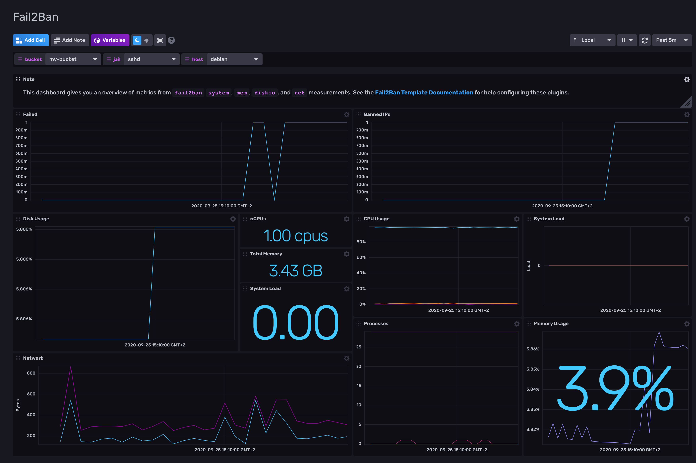
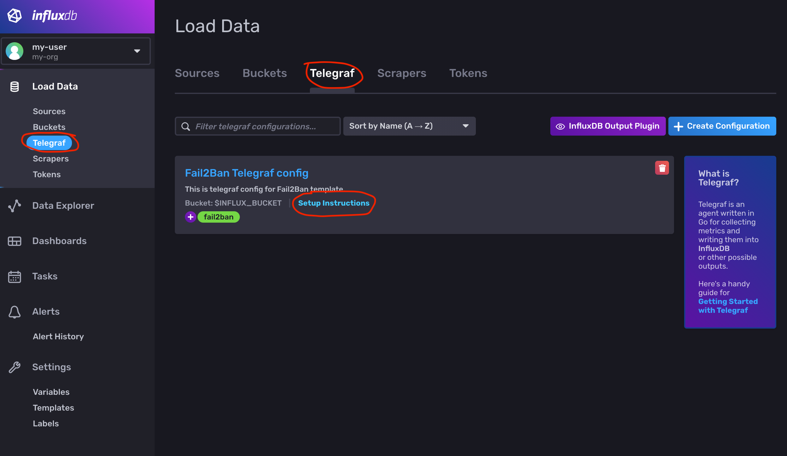

## Fail2Ban Monitoring Template with Telegraf

### Dashboards

#### Fail2Ban

    

#### InfluxDB UI

In the InfluxDB UI, go to Settings->Templates and enter this URL: https://raw.githubusercontent.com/influxdata/community-templates/master/fail2ban/img/fail2ban-template.yml

#### Influx CLI
If you have your InfluxDB credentials configured in the CLI, you can install this template with:

`influx apply -f https://raw.githubusercontent.com/influxdata/community-templates/master/fail2ban/fail2ban-template.yml`

## Requirements

* Set environment variables on host/s from which Telegraf will be sending metrics.  These are:

  - `INFLUX_ORG`
  - `INFLUX_TOKEN`
  - `INFLUX_HOST`
  - `INFLUX_BUCKET`

## Setup Instructions

Once installed, you'll need to start up Telegraf to pull metrics from your Fail2Ban client.  Checkout [Telegraf docs](https://docs.influxdata.com/telegraf/) for installing and starting Telegraf.

To start Telegraf with the template-provided configuration follow setup instructions:

  

## Setup Fail2Ban

You can use Fail2Ban that is packed in your favorite Linux Distribution. 
On Debian based distributions you can use `apt install fail2ban`.
 
Telegraf uses `fail2ban-client` commandline tool to read metrics. Telegraf needs to have a permission
to access `/var/run/fail2ban/fail2ban.sock` run  `fail2ban-client`.

To check this try run `fail2ban-client status` under telegraf user account.
If you see:
```
fail2ban-client status
Permission denied to socket: /var/run/fail2ban/fail2ban.sock, (you must be root)
``` 
You can fix socket permission issue like this:

#### Add new group fail2ban

`root@debian:~$ addgroup --group fail2ban`

#### Add user telegraf to fail2ban group

`root@debian:~$ usermod -a -G fail2ban telegraf`

#### Set permissions

```
root@server:~$ chown root:fail2ban /var/run/fail2ban/fail2ban.sock
root@server:~$ chmod g+rwx /var/run/fail2ban/fail2ban.sock
```

Now you can run `fail2ban-client status` again, and you should see:

```
rob@server:~$ fail2ban-client status
Status
|- Number of jail:	1
`- Jail list:	sshd
```

Note that this permission fix can be reset by systemd.

### Systemd fail2ban.service settings
To make permissions permanent you can append them into systemd `/lib/systemd/system/fail2ban.service` configuration: 

```
[Service]
...
ExecStartPost=/bin/sh -c "while ! [ -S /run/fail2ban/fail2ban.sock ]; do sleep 1; done"
ExecStartPost=/bin/chgrp fail2ban /run/fail2ban/fail2ban.sock
ExecStartPost=/bin/chmod g+w /run/fail2ban/fail2ban.sock
```

Then restart the service:
```
root@server:~$ systemctl restart zabbix-agent.service
```

## Included resources

- 1 label: `fail2ban`
- 1 Dashboard: `Fail2Ban Metrics` 
- 3 Variables: `bucket`, `host`, `jail`
- 1 Telegraf Configuration: 
    - `[[inputs.fail2ban]]` - [https://github.com/influxdata/telegraf/tree/master/plugins/inputs/fail2ban](https://github.com/influxdata/telegraf/tree/master/plugins/inputs/fail2ban)
    - basic system  metrics from `[[inputs.cpu]], [[inputs.system]], [[inputs.kernel]], [[inputs.mem]], [[inputs.net]], [[inputs.processes]],[[inputs.disk]], [[inputs.diskio]]` plugins

## Measurements
<details>

<summary>fail2ban</summary>

* Tags
  * host
  * jail
* Fields
  * failed
  * banned
</details>

## Contact

Author: Robert Hájek

Email: robert.hajek@bonitoo.io

Github: rhajek

Influx Slack: @robert.hajek
