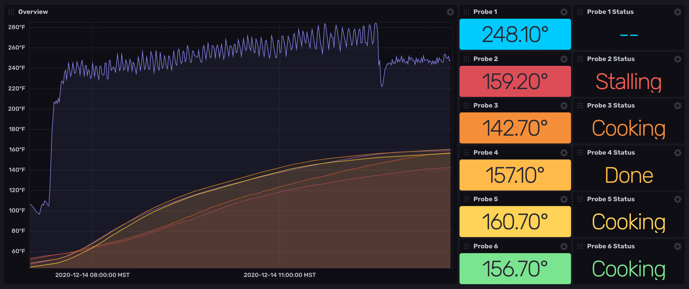
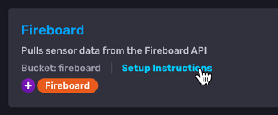

## Fireboard Monitoring Template

Provided by: [Scott Anderson](https://github.com/sanderson/)

Use this InfluxDB template to monitor data collected by the
[Fireboard cloud-connected thermometer](https://www.fireboard.com/).



## Quick Install

### InfluxDB UI

In the InfluxDB UI, go to **Settings > Templates** and enter the following URL:

```sh
https://raw.githubusercontent.com/influxdata/community-templates/master/fireboard/fireboard.yml
```

### Influx CLI

If you have your InfluxDB credentials [configured in the CLI](https://docs.influxdata.com/influxdb/v2.0/reference/cli/influx/config/), install this template with:

```sh
influx apply -u https://raw.githubusercontent.com/influxdata/community-templates/master/fireboard/fireboard.yml
```

## Included Resources

- 1 Bucket: `fireboard`
- 1 Telegraf Configuration: `Fireboard`
- 1 Dashboard: `Fireboard`
- 12 Dashboard Variables:
  - `probe1_target`
  - `probe1_type`
  - `probe2_target`
  - `probe2_type`
  - `probe3_target`
  - `probe3_type`
  - `probe4_target`
  - `probe4_type`
  - `probe5_target`
  - `probe5_type`
  - `probe6_target`
  - `probe6_type`
- 1 Task: `Fireboard Stall Check`
- 1 Notification Endpoint: `Example Endpoint`
- 1 Notification Rule: `Fireboard Stall Notification`
- 1 Label: `Fireboard`

## Setup

General instructions on using InfluxDB Templates can be found in [Use a template](../docs/use_a_template.md).

### Get Your Fireboard Authentication Token

1. [Create a Fireboard account](https://docs.fireboard.io/start/account.html#create-your-account).
2. `POST` your login credentials to the Fireboard API to retrieve your Fireboard authentication token.

    ```sh
    curl https://fireboard.io/api/rest-auth/login/
      -X POST
      -H 'Content-Type: application/json'
      -d '{"username":"your-username-here","password":"your-password-here"}'
    ```

    ##### Example response
    ```json
    { "key": "9944bb9966cc22cc9418ad846dd0e4bbdfc6ee4b" }
    ```

### Configure Environment Variables

The data for the Fireboard dashboard is populated by the Telegraf configuration
included in the template.
The Telegraf configuration requires the following environment variables:

- `INFLUX_TOKEN` - InfluxDB authentication token with the permissions to read
  Telegraf configurations and write data to the `fireboard` bucket.
  Use your operator token to get started or generate a new token in the
  Telegraf configuration setup instructions.
  Find tokens in the InfluxDB UI under **Load Data > Tokens**.
- `INFLUX_ORG` - Name of your InfluxDB organization.
  If using InfluxDB Cloud, this is the email address you used to create your account.
  To find your organization name, click your user avatar in the InfluxDB UI.
  Your organization name appears under your username.
- `INFLUX_HOST` - The URL of your InfluxDB instance.
  See [InfluxDB Cloud regions](https://docs.influxdata.com/influxdb/cloud/reference/regions/)
  or [InfluxDB OSS 2.x URLs](https://docs.influxdata.com/influxdb/latest/reference/urls/).
- `FIREBOARD_TOKEN` – Your [Fireboard authentication token](#get-your-fireboard-authentication-token).

You **MUST** set these environment variables **before** running Telegraf.
Using commands similar to the following:

```sh
export INFLUX_TOKEN=YourInfluxDBAuthToken
export INFLUX_ORG=YourInfluxDBOrg
export INFLUX_HOST=http://localhost:8086
export FIREBOARD_TOKEN=YourFireboardAuthToken
```

## Run Telegraf

1. [Download and install Telegraf](https://portal.influxdata.com/downloads/).
2. Start Telegraf using the instructions provided in **Load Data > Telegraf > Setup Instructions**
   in the InfluxDB UI.

    

## Customizations

### Dashboard Cells

The **Fireboard dashboard** provided by the template includes cells for individual
Fireboard probes that display the current temperature and cooking status.
Use the dashboard variables specific to each cell to select the following:

- **Probe target:** target temperature for the probe (`30 - 300`)
- **Probe type:** `Ambient` or `Food`

### Fireboard Stall Check Task

The **Fireboard Stall Check** task provided by the template includes a `meatProbes`
variable that lists which Fireboard probe channels should be tracked when
identifying stalls. By default, the task assumes **Probe 1** is an ambient probe
and all other probes should be tracked. To change what channels are tracked,
edit the task and customize the variable:

```js
meatProbes = [2,3,4,5,6]
```

_**NOTE:** The **Fireboard Stall Check** task is disabled by default._

### Notification Endpoint
The template provides tasks that trigger notifications.
To send notifications, [add a notification endpoint](https://docs.influxdata.com/influxdb/v2.0/monitor-alert/notification-endpoints/create/).

## Contact

- Author: Scott Anderson
- Email: scott@influxdata.com
- Github: [@sanderson](https://github.com/sanderson)
- Influx Slack: [@Scott](https://influxdata.com/slack)
