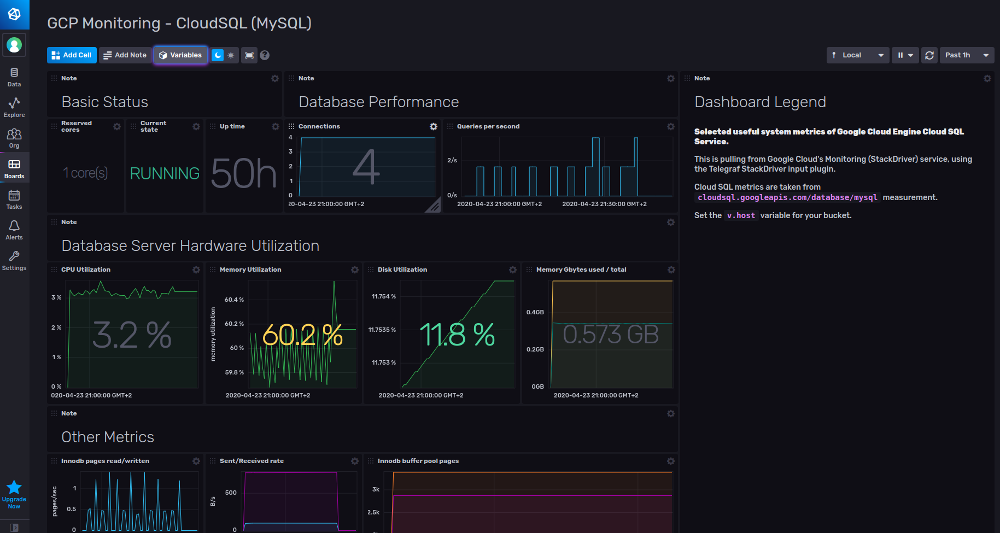
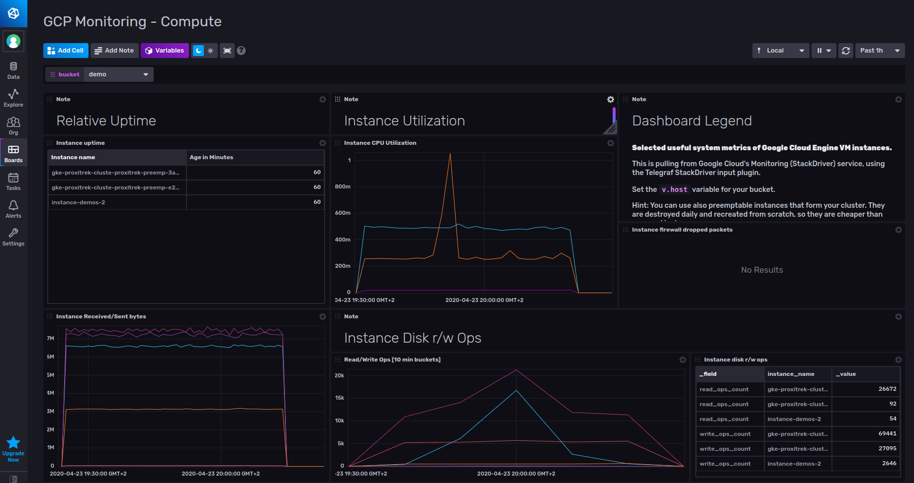
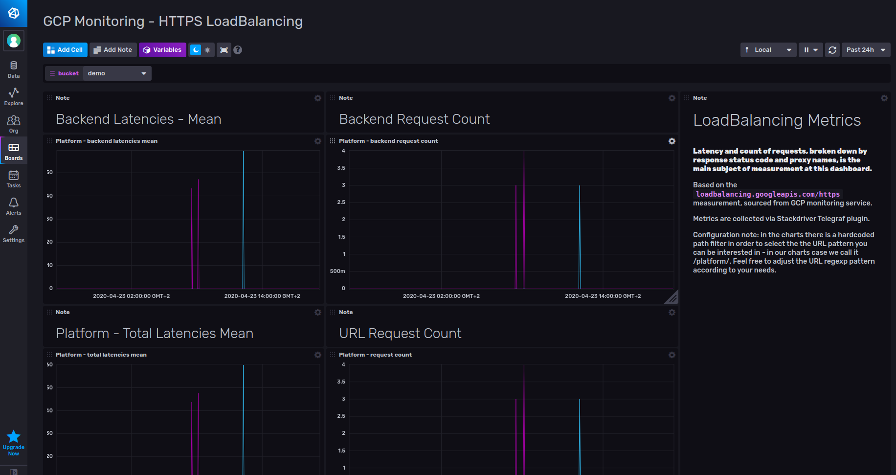

# Google Cloud Platform Monitoring Template

Provided by: [bonitoo.io](.)

**Display data from Google Cloud Monitoring -- formerly Stackdriver -- using the
Cloud Monitoring API v3.**

1. MySQL database hosted in Google Cloud SQL
2. The Compute dashboard provides deeper insight into the GCP compute services
   provided by GCP Stackdriver.
3. HTTPS LoadBalancing dashboard monitors network load balancing in the cluster.

Dashboard examples

## Included Resources

The solution composes of the following resources:

- 2 Labels: `inputs.stackdriver`, `GCP`
- 3 Dashboards: `CloudSQL`, `Compute` and `HTTPS LoadBalancing`
- 1 Variable: `bucket`

## Setup Instructions

Load the dashboards and use the Telegraf Stackdriver plugin into your
environment.

Set the `v.bucket` variable in the dashboards or settings to let dashboards know
what bucket holds the data.

## Customizations

n/a

## Contact

Provide a way for users to get in touch with you if they have questions or need help using your template. What information you give is up to you, but we encourage providing those below.

Author: Ivan Kudibal, Tomas Klapka, https://www.bonitoo.io

Github: @ivankudibal
