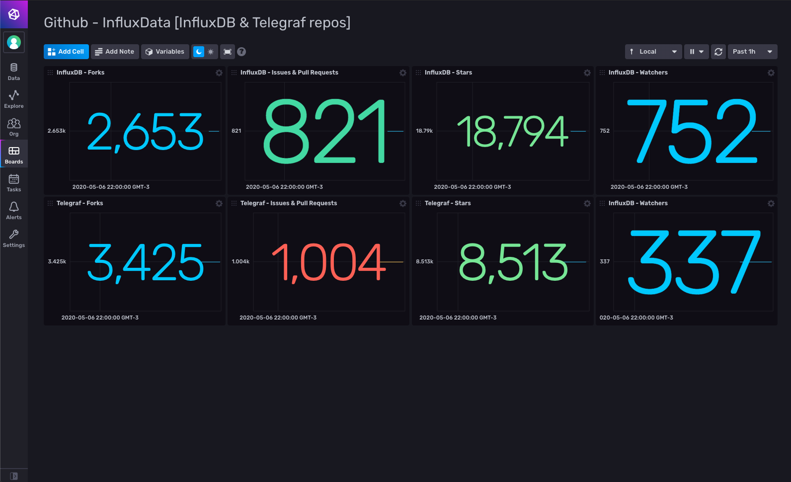

# Github Dashboard for InfluxDB v2

Provided by: Ignacio Van Droogenbroeck

This dashboard help you get metrics of your Github repository. 



### Quick Install

If you have your InfluxDB credentials [configured in the CLI](Vhttps://v2.docs.influxdata.com/v2.0/reference/cli/influx/config/), you can install this template with:

```
influx apply -u https://raw.githubusercontent.com/influxdata/community-templates/master/github/github.yml
```

## Included Resources

    - 1 Telegraf: `Configuration: Github Inputs`
    - 1 Dashboards: `Github - InfluxData [InfluxDB & Telegraf repos]`
    - 1 Bucket: `github`
    - 1 Label: `github`

## Setup Instructions

General instructions on using InfluxDB Templates can be found in the [use a template](../docs/use_a_template.md) document.
    
    Telegraf Configuration requires the following environment variables
    - `INFLUX_TOKEN` - The token with the permissions to read Telegraf configs and write data to the `telegraf` bucket. You can just use your operator token to get started.
    - `INFLUX_ORG` - The name of your Organization.
    - `GITHUB_ACCESS_TOKEN` - Your personal Github token for making API calls

> You can generate a Token Access Key from Github on this page: https://github.com/settings/tokens. 

## Contact

Author: Ignacio Van Droogenbroeck

Email: ignacio[at]vandroogenbroeck[dot]net

Github and Gitlab user: @xe-nvdk 

Influx Slack: Ignacio Van Droogenbroeck