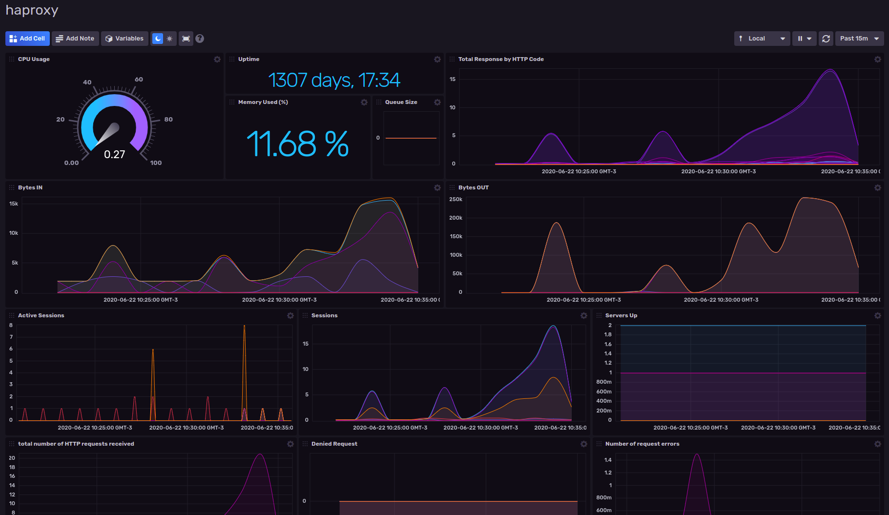

# HAProxy for InfluxDB v2

Provided by: Ignacio Van Droogenbroeck

This dashboard help you get metrics of your HAProxy instance. 



### Quick Install

If you have your InfluxDB credentials [configured in the CLI](Vhttps://v2.docs.influxdata.com/v2.0/reference/cli/influx/config/), you can install this template with:

```
influx pkg -u https://raw.githubusercontent.com/influxdata/community-templates/master/haproxy/haproxy.yml
```

## Included Resources

    - 1 Telegraf: `haproxy-config`
    - 1 Dashboards: `haproxy`
    - 1 Bucket: `haproxy`
    - 1 Label: `haproxy`

## Setup Instructions

General instructions on using InfluxDB Templates can be found in the [use a template](../docs/use_a_template.md) document.
    
    Telegraf Configuration requires the following environment variables
    - `INFLUX_TOKEN` - The token with the permissions to read Telegraf configs and write data to the `telegraf` bucket. You can just use your master token to get started.
    - `INFLUX_ORG` - The name of your Organization.
    - `INFLUX_HOST` - The host where run InfluxDB

In order to use this template, you need to specify the HAProxy instance, if you have one to monitor, you can pass as variable the name and port of the host. Ex <code>$ export haproxy_stats=http://localhost:10000/stats</code>
If you have more instances of HAProxy I recommend you to edit the haproxy.yml to add others hosts.

## Contact

Author: Ignacio Van Droogenbroeck

Email: ignacio[at]vandroogenbroeck[dot]net

Github and Gitlab user: @xe-nvdk 

Influx Slack: Ignacio Van Droogenbroeck