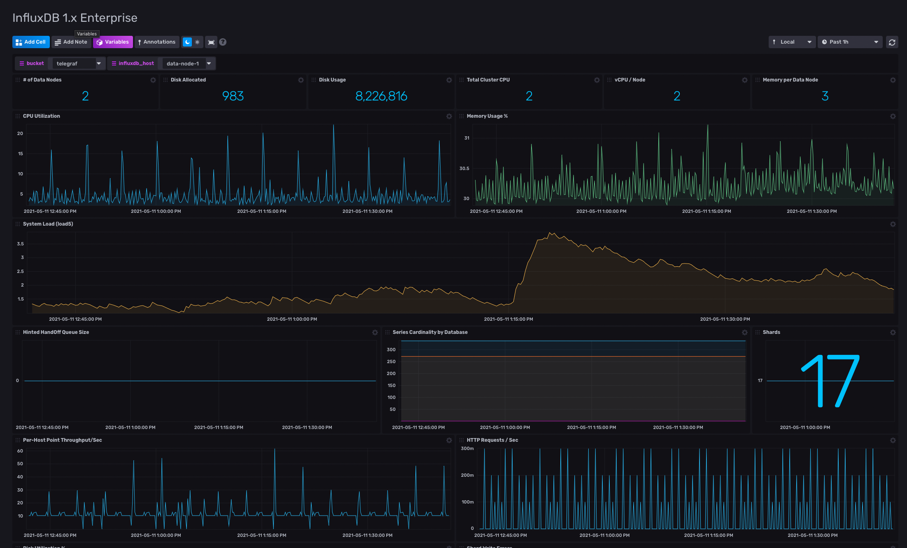

# InfluxDB Enterprise 1.x

Provided by: Ignacio Van Droogenbroeck

This dashboard allows you to monitor yours Data Nodes in a InfluxDB Enterprise Cluster. 



### Quick Install

#### InfluxDB UI

In the InfluxDB UI, go to Settings->Templates and enter this URL: https://raw.githubusercontent.com/influxdata/community-templates/master/influxdb-enterprise-1x/enterprise.yml

#### Influx CLI
If you have your InfluxDB credentials [configured in the CLI](https://v2.docs.influxdata.com/v2.0/reference/cli/influx/config/), you can install this template with:

```
influx apply -u https://raw.githubusercontent.com/influxdata/community-templates/master/influxdb-enterprise-1x/enterprise.yml
```

## Included Resources

  - 1 Telegraf Configuration: 'monitoring-enterprise-1x'
  - 1 Dashboards: 'InfluxDB 1.x Enterprise'
  - 1 Label: 'enterprise'
  - 2 Variables: 'influxdb_host', 'bucket'

## Setup Instructions

General instructions on using InfluxDB Templates can be found in the [use a template](../docs/use_a_template.md) document.

Telegraf Configuration requires the following environment variables
  - `INFLUX_TOKEN` - The token with the permissions to read Telegraf configs and write data to the `telegraf` bucket. You can just use your operator token to get started.
  - `INFLUX_ORG` - The name of your Organization.
  - `INFLUX_HOST` - The address of you InfluxDB

In order to use this template, I recommend you open a [InfluxDB Cloud account](https://www.influxdata.com/products/influxdb-cloud/).

## Contact

Author: Ignacio Van Droogenbroeck

Email: ignacio[at]vandroogenbroeck[dot]net

Github and Gitlab user: @xe-nvdk

Influx Slack: Ignacio Van Droogenbroeck