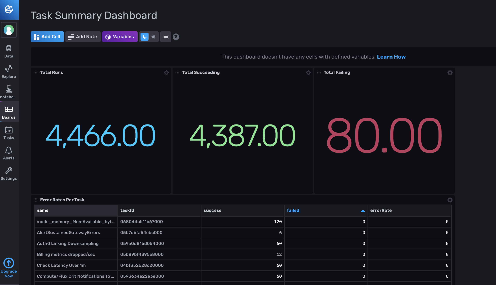
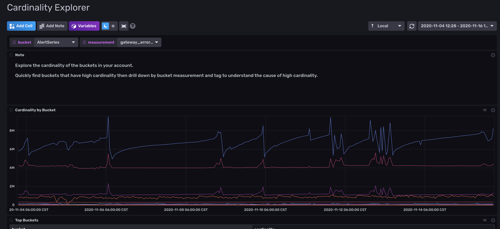
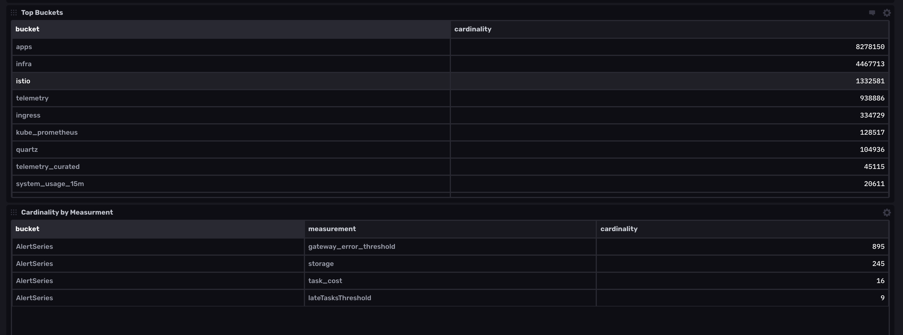

# InfluxDB 2 Operational Monitoring

Provided by: InfluxData

This InfluxDB Template can be used to monitor your InfluxDB tasks and cardinality on your already running InfluxDB 2 instance. This template is only compatible with both the open source and the Cloud version of InfluxDB 2.

Monitoring your tasks allows you to:
1) Verify that critical downsampling and data transforation tasks are succeeding. 
2) Respond to task failures quickly. 



Monitoring your cardinality allows you to: 
1) Ensure that you're not experiencing runaway cardinality.
2) Verify that your downsampling tasks and retention policies are successfully reducing your series cardinality. 

This `Cardinality Explorer` dashboard is used by InfluxData to monitor the cardinality of InfluxData's own production monitoring InfluxDB instance.  The `cardinality` bucket is populated by the `cardinality_by_bucket` task which summarizes schema data about your InfluxDB instance. 

If the cardinality of a bucket is increasing exponentially, use this dashboard to drill into the cardinality of specific measurements to identify the source of runaway cardinality. 

### Quick Install

#### InfluxDB UI

In the InfluxDB UI, go to Settings->Templates and enter this URL: https://raw.githubusercontent.com/influxdata/community-templates/master/influxdb2_operational_monitoring/influxdb2_operational_monitoring.yml

#### Influx CLI
If you have your InfluxDB credentials [configured in the CLI](https://v2.docs.influxdata.com/v2.0/reference/cli/influx/config/), you can install this template with:

```
influx apply -u https://raw.githubusercontent.com/influxdata/community-templates/master/influxdb2_operational_monitoring/influxdb2_operational_monitoring.yml
```

## Included Resources

  - 1 Bucket: `cardinality`, Forever
  - 1 Task: `cardinality_by_bucket`, 1h
  - 2 Labels: `operational_monitoring` 
  - 2 Dashboard: `Task Summary Dashboard`, `Cardinality Explorer`

## Setup Instructions

  General instructions on using InfluxDB Templates can be found in the [use a template](../docs/use_a_template.md) document.

  The data for the `Task Summary Dashboard` is populated by data collected from the default `_tasks` bucket. The `Cardinality Explorer` dashboard is populated by data collected from the `cardinality` bucket. The best way to set this up is to first follow the instructions for installing any template. That will create the label, bucket, and dashboards for you.

  You must already have a task running in order to populate the `Task Summary Dashboard` with data. [Get started with InfluxDB tasks](https://docs.influxdata.com/influxdb/v2.0/process-data/get-started/) to create a task and populate the dashboard.  

## Contact

- Author: Anais Dotis-Georgiou
- Email: anais@influxdata.com
- Github: [@Anaisdg](https://github.com/Anaisdg)
- Influx Slack: [@Anais](https://influxdata.com/slack)
