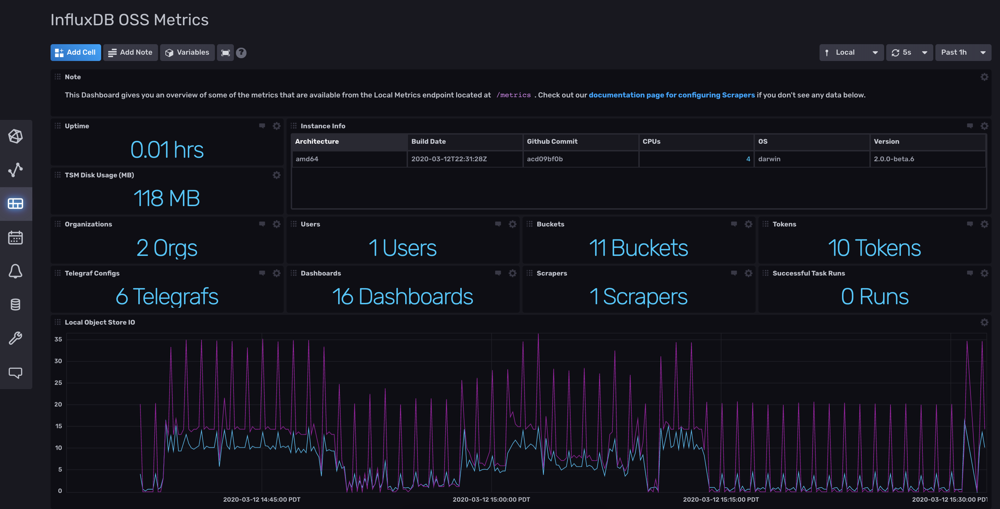
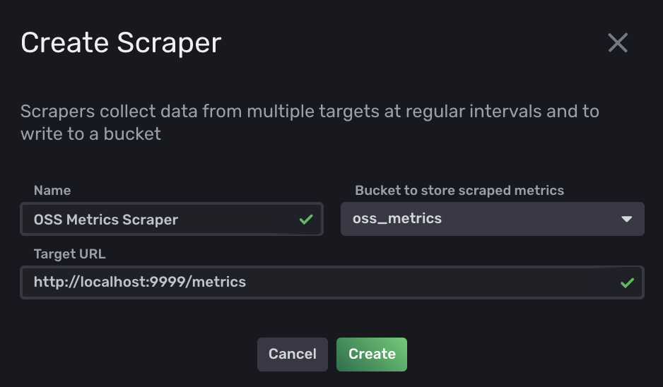

# InfluxDB 2 Open Source Metrics Template

Provided by: InfluxData

This InfluxDB Template can be used to monitor your already running InfluxDB 2 instance being collected by the built in prometheus scraper. This template is only compatible with the open source version of InfluxDB 2.



### Quick Install

If you have your `INFLUX_HOST`, `INFLUX_ORG` and `INFLUX_TOKEN` environment variables setup, you can install this template with:

```
influx pkg -u https://raw.githubusercontent.com/influxdata/community-templates/master/influxdb2_oss_metrics/influxdb2_oss_metrics.yml
```

## Included Resources

  - 1 Bucket: `oss_metrics`, 7d retention
  - 2 Labels: `InfluxDB2`,`prometheus`
  - 1 Dashboard: `InfluxDB OSS Metrics`

## Setup Instructions

  General instructions on using InfluxDB Templates can be found in the [use a template](../docs/use_a_template.md) document.

  The data for the dashboard is populated by data collected by scraping the prometheus metrics endpoint in your OSS instance. The best way to set this up is to first follow the instructions for installing any template. That will create the labels, bucket, and dashboard for you.

  Then, from the InfluxDB UI (usually found at http://localhost:9999 in your browser), configure a default scraper to write the scrape data from `http://localhost:9999/metrics` into the `oss_metrics` bucket. More information about scrapers can be found in our [documentation](https://v2.docs.influxdata.com/v2.0/write-data/scrape-data/).



## Customizations

  There are many more metrics collected than the ones displayed on the dashboard. Check out localhost:9999/metrics for a full list. They are also available by exploring the data populated in the `oss_metrics` bucket.

## Contact

- Author: Russ Savage
- Email: russ@influxdata.com
- Github: [@russorat](https://github.com/russorat)
- Influx Slack: [@russ](https://influxdata.com/slack)
