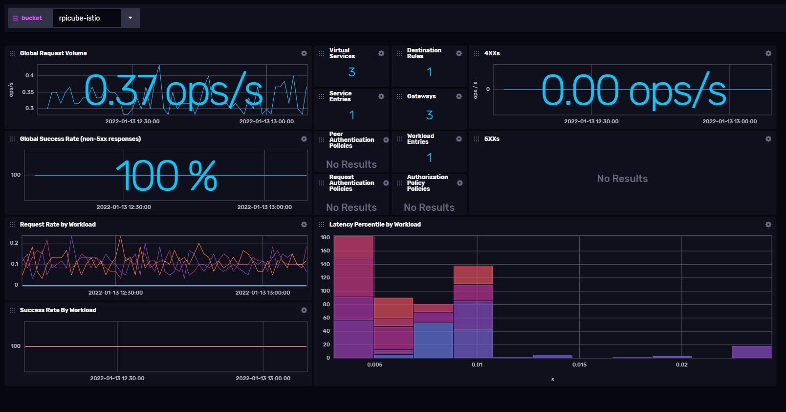
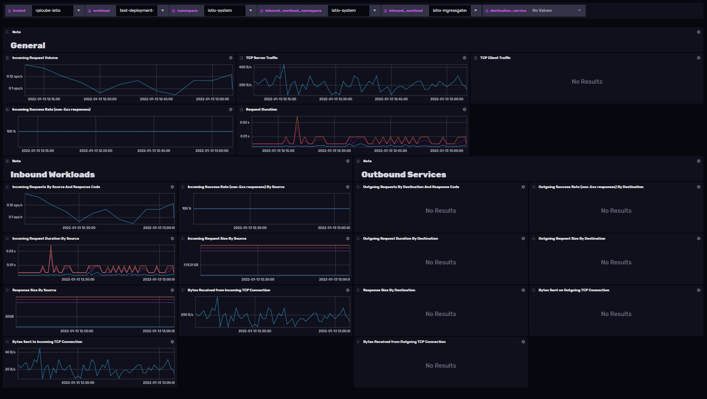
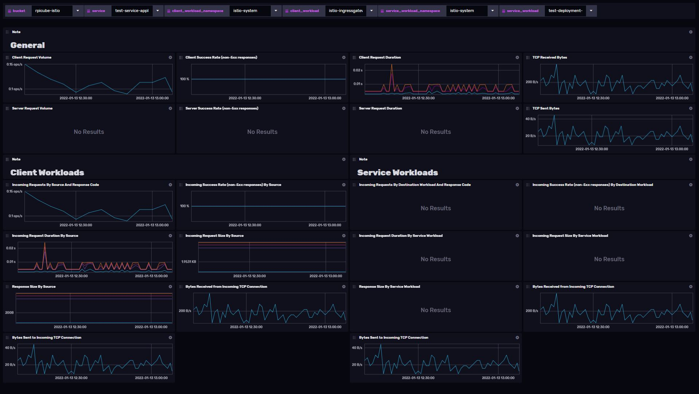
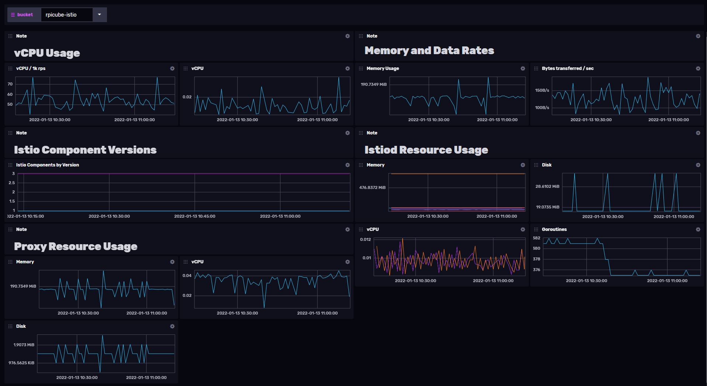

# Istio Template

Provided by: [bonitoo.io](.)

Istio is a service mesh—a modernized service networking layer that provides a transparent and language-independent way to flexibly and easily automate application network functions. It is a popular solution for managing the different microservices that make up a cloud-native application. Istio service mesh also supports how those microservices communicate and share data with one another.

This Istio template can be used to monitor your Istio deployment with following dashboards:

Istio Control Plane Dashboard:


Istio Mesh Dashboard:


Istio Workload Dashboard:


Istio Service Dashboard:


Istio Performance Dashboard:


### Quick Install

#### InfluxDB UI

In the InfluxDB UI, go to Settings->Templates and enter this URL: https://raw.githubusercontent.com/influxdata/community-templates/master/istio/istio.yml

#### Influx CLI

If you have your InfluxDB credentials [configured in the CLI](https://v2.docs.influxdata.com/v2.0/reference/cli/influx/config/), you can install this template with:

```
influx apply -u https://raw.githubusercontent.com/influxdata/community-templates/master/istio/istio.yml
```

## Included Resources

- 1 Label: `istio`
- 1 Telegraf DaemonSet Configuration: `istio-daemonset`
- 5 Dashboards: `Istio Control Plane Dashboard`, `Istio Mesh Dashboard`, `Istio Workload Dashboard`, `Istio Service Dashboard`, `Istio Performance Dasboard`
- 11 Variables: `bucket`, `client_workload`, `client_workload_namespace`, `destination_service`, `inbound_workload`, `inbount_workload_namespace`, `namespace`, `service`, `service_workload`, `service_workload_namespace`, `workload`

## Setup Instructions

General instructions on using InfluxDB Templates can be found in the [use a template](../docs/use_a_template.md) document.

### Requirements:

#### Istio:

- Istio installation: https://istio.io/latest/docs/setup/install/
- Istio exposes metrics based on standard prometheus.io annotations.

#### Telegraf:

Telegraf uses the Prometheus input plugin to scrape Prometheus metrics endpoints of istiod/envoy proxies and kubernetes.default service metrics API URLs.
It requires running Telegraf as DaemonSet to scrape Kubernetes node and cadvisor metrics API URLs for specific node.

The Telegraf configuration requires the following environment variables

- `INFLUX_HOST`
- `INFLUX_BUCKET`
- `INFLUX_TOKEN` - The token with the permissions to read Telegraf configs and write data to the `telegraf` bucket. You can just use your operator token to get started.
- `INFLUX_ORG` - The name of your Organization

> Any specific configuration reflecting custom Kubernetes or Istio deployment might require additional changes in Telegraf/Istio configuration.

You **MUST** set these environment variables before running Telegraf using something similar to the following commands

- This can be found on the `Load Data` > `Tokens` page in your browser: `export INFLUX_TOKEN=TOKEN`
- Your Organization name can be found on the Settings page in your browser: `export INFLUX_ORG=my_org`

## Contact

- Email: tomas.klapka@bonitoo.io
