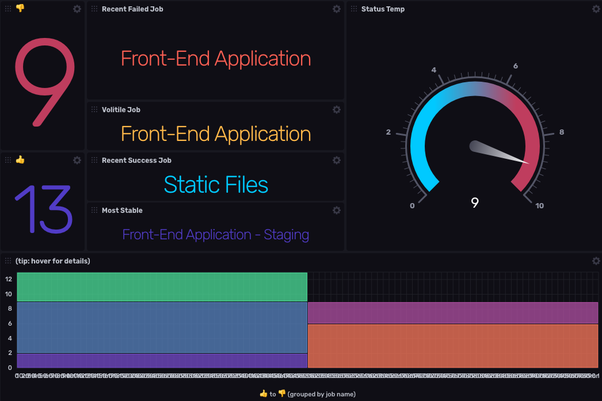

## jenkins Monitoring Template

This InfluxDB Template can be used to montior a Jenkins instance

### Included Resources

- `Jenkins - High-Resolution` Dashboard (see screenshot above)
- `Jenkins - Single Job` Dashboard
- `Jenkins` Telegraf configuration
- Variables for `jenkinJobNames`, `jenkinsBucket`, and `jenkinsHostnames`. You will need to update the value for these thru the InfluxDB UI `Settings` > `Variables` after you've installed this dashboard template
- Bucket handled by variable `jenkinsBucket`
- Label `jenkins` applied to all resources
- `Job Duration Check` a **threshold** alert
- `Node Health` a **deadman** alert based on the `mem_total`

## Setup Instructions

### Jenkins

In order to collect information from your jenkins server, you will need:

- `url` of your Jenkins instance
- `username` the username for your Jenkins
- `password` the password for your user

## Configuring Jenkins

No configuration is necessary to gather Jenkins data other than having valid credentials.

### Telegraf
  The data for the dashboard is populated by the included Telegraf Jenkins configuration. The Configuration requires the following environment variables

  - `INFLUX_TOKEN` - The token with the permissions to read Telegraf configs and write data to the `telegraf` bucket. You can just use your master token to get started.
  - `INFLUX_ORG` - The name of your Organization (this will be your email address on the InfluxDB Cloud free tier)
  - `INFLUX_HOST` - The URL of your InfluxDB host (this can your localhost, a remote instance, or InfluxDB Cloud)
  - `JENKINS_HOST` - The URL where your Jenkins is located
  - `JENKINS_USERNAME` - The username to use
  - `JENKINS_PASSWORD` - The password for your username
  - `JENKINS_BUCKET` - the bucket to store your data

  You **MUST** set these environment variables before running Telegraf using something similar to the following commands

  - This can be found on the `Load Data` > `Tokens` page in your browser: `export INFLUX_TOKEN=TOKEN`
  - Your Organization name can be found on the Settings page in your browser: `export INFLUX_ORG=my_org`

## Customizations

Be sure to update the values for these variables: `jenkinJobNames`, `jenkinsBucket`, and `jenkinsHostnames`

## Contact

- Author: Ray Farias
- Email: ray@sudokrew.com
- Github: [@sgnl](https://github.com/sgnl)
- Influx Slack: [@Ray Farias](https://influxdata.com/slack)