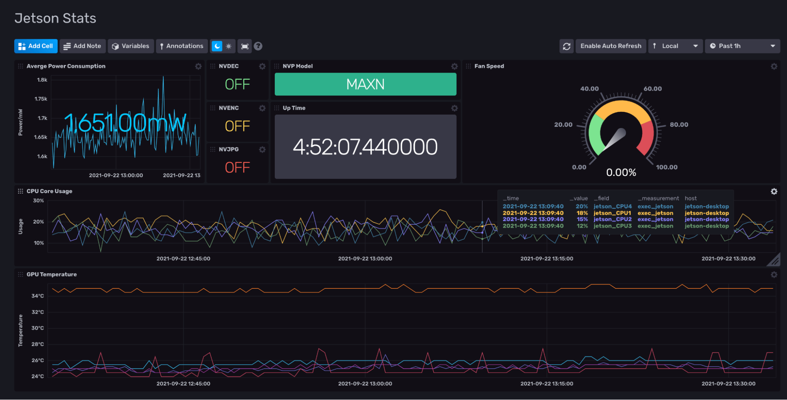

# Jetson_Stats

Provided by: Jay Clifford

This InfluxDB Template can be used to gather system metrics from a Jetson Stats instance. 

The goal of this template is to provide system stats from a Jetson Nano and other devices within the Jetson family. Jetson devices do not have access to NVIDIA SMI meaning gathering useful GPU statistics is difficult. This template monitors the following system assets:
- Power Consumption
- Fan Speed
- CPU Core Usage
- GPU Temperature
- GPU Utilization
- Up Time
- Core System Flags

##### Dashboard examples



This template makes use of [Jetson_Stats](https://github.com/rbonghi/jetson_stats) make sure you install this package on your Jetson device. 

### Quick Install

#### InfluxDB UI

In the InfluxDB UI, go to Settings->Templates and enter this URL: https://raw.githubusercontent.com/influxdata/community-templates/master/jetson_stats/jetson-stats.yml

#### Influx CLI
If you have your InfluxDB credentials [configured in the CLI](https://v2.docs.influxdata.com/v2.0/reference/cli/influx/config/), you can install this template with:

```
influx apply -u https://raw.githubusercontent.com/influxdata/community-templates/master/jetson_stats/jetson-stats.yml
```

## Included Resources
  - 1 Bucket: `Jetson`, 7d retention
  - 1 Telegraf Configuration
  - 1 Dashboards: `Jetson Stats`
  - 2 Variables: `bucket` and `measurments`

## Setup Instructions

General instructions on using InfluxDB Templates can be found in the [use a template](../docs/use_a_template.md) document.

For instructions on how to install Jetson Stats and configure the Exec Pluglin follow this blog [here](https://www.influxdata.com/blog/nvidia-jetson-series-part-1-jetson-stats/)

## Customizations

This template can will relate directly to the NVIDIA DeepStream Vision pipline template on its release. This template can be installed standalone or as a bundle with the DeepStream template. 

## Contact

Provide a way for users to get in touch with you if they have questions or need help using your template. What information you give is up to you, but we encourage providing those below.

Author: Jay Clifford

Email: [jclifford@influxdata.com](mailto:jclifford@influxdata.com)

Github: [@Jayclifford345](https://github.com/Jayclifford345)

Influx Slack: [Jay Clifford](https://influxcommunity.slack.com/team/U02E8MP82SW)