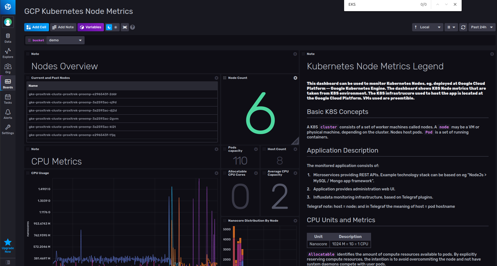
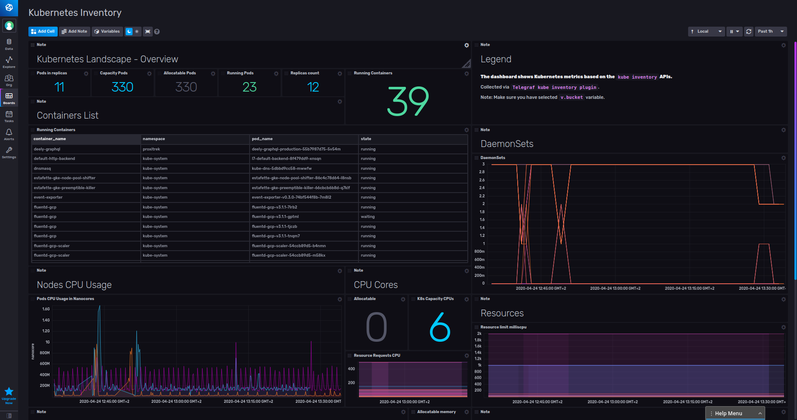

# Kubernetes Monitoring template

Provided by: [bonitoo.io](.)

**This template provides 2 basic Kubernetes dashboards:
`Kubernetes Node Metrics` and `Kubernetes Inventory`. The K8S infrastructure
supports Google Cloud Platform, AWS and on-premise K8S environments.**


##### Dashboard examples





### Quick install

If you have your InfluxDB credentials [configured in the CLI](Vhttps://v2.docs.influxdata.com/v2.0/reference/cli/influx/config/), you can install this template with:

```
influx apply -f https://raw.githubusercontent.com/influxdata/community-templates/master/k8s/k8s.yml
```

## Included resources

This template includes the following:

- 3 Labels: `inputs.kubernetes`, `inputs.kube_inventory`, `K8S`
- 2 Dashboards: `Kubernetes Node Metrics`, `Kubernetes Inventory`
- 1 Variables: `bucket`
- 1 Telegraf Config: `K8S Configuration`


## Setup instructions

Set up and install Telegraf `kubernetes` and `kube_inventory` plugins into your
Telegraf configmap.

* https://github.com/influxdata/telegraf/tree/master/plugins/inputs/kubernetes
* https://github.com/influxdata/telegraf/tree/master/plugins/inputs/kube

Visit the dashboard and use the `v.bucket` variable to select which bucket the data is stored in.

## Customizations

n/a

## Contact

Authors: Ivan Kudibal, Tomas Klapka, https://www.bonitoo.io

Github: @ivankudibal
