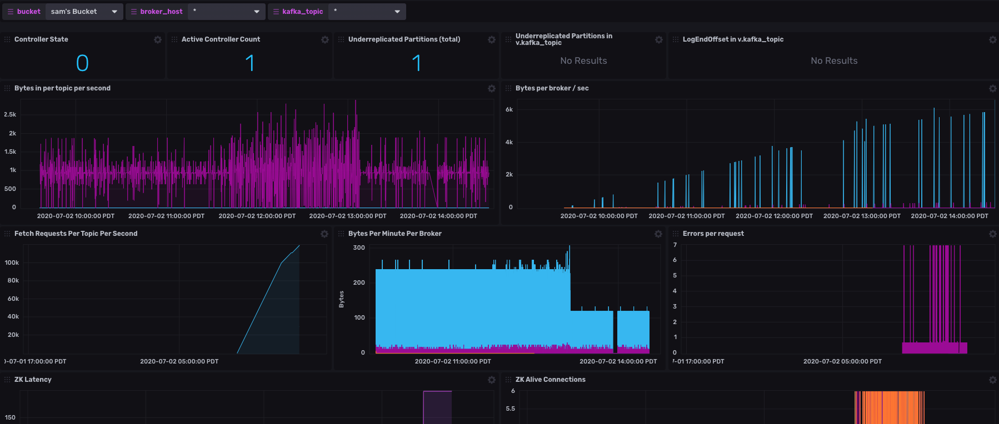
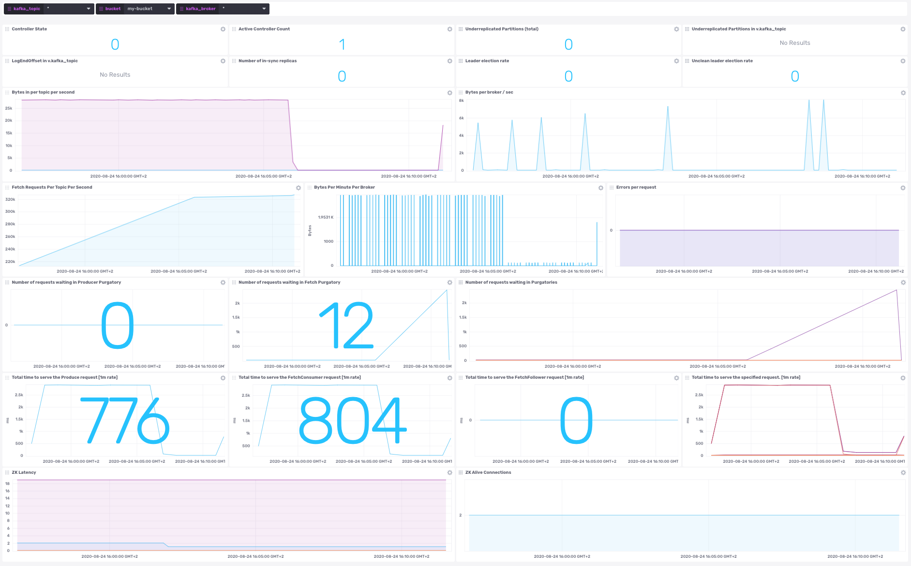
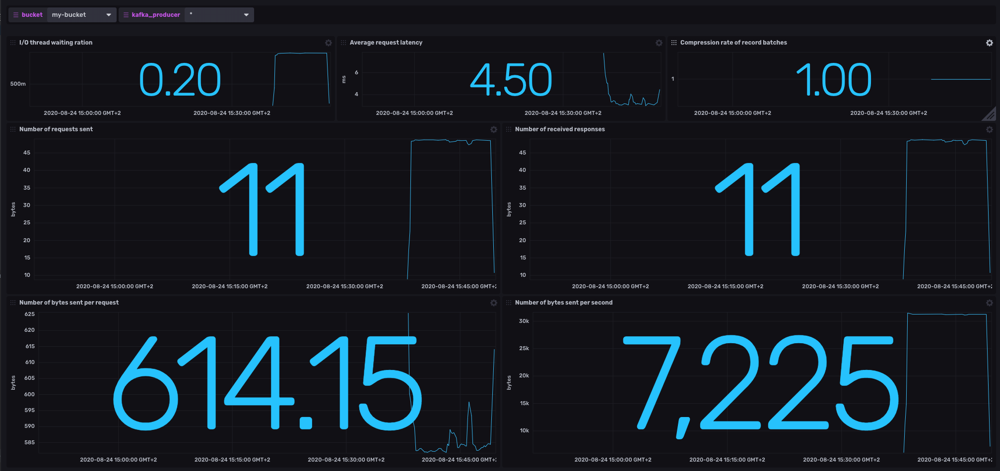
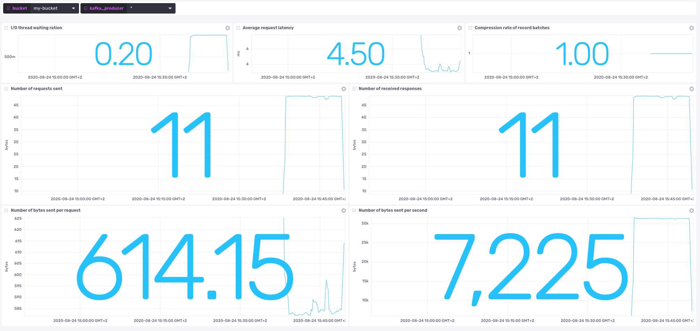
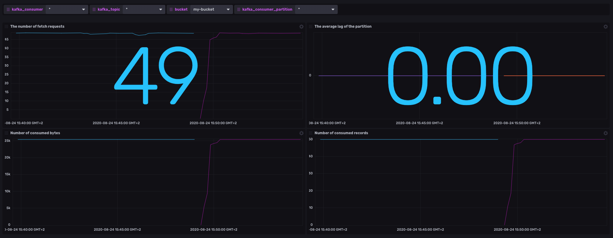
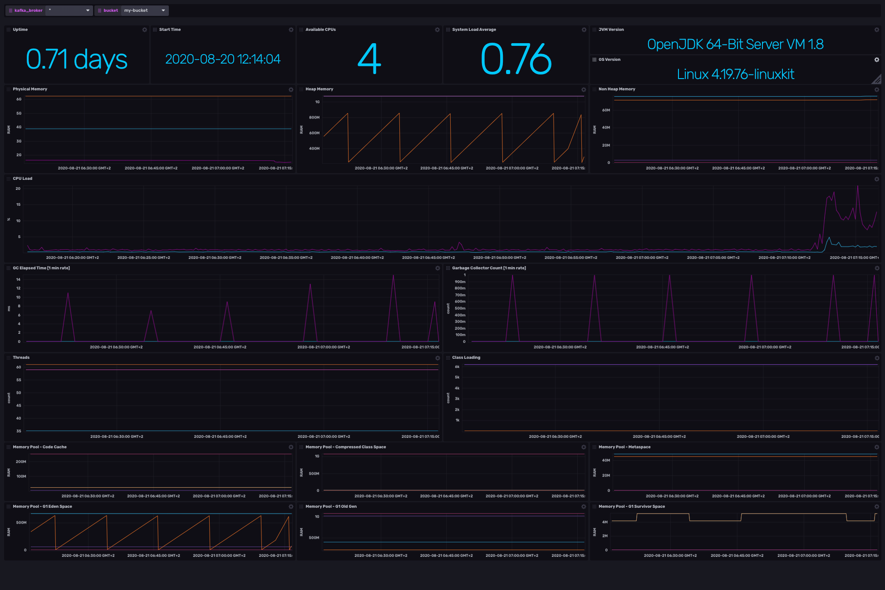
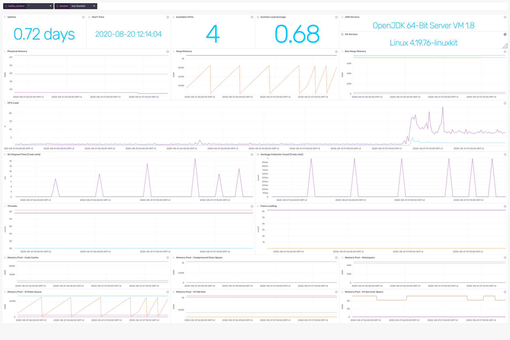

# Kafka Monitoring Template with Telegraf and Jolokia

## Dashboards

### Kafka

    
   
### Kafka Producer Metrics

    
   
### Kafka Consumer Metrics

    

### Kafka JVM
   
    

## Requirements

* Set environment variables on host/s from which Telegraf will be sending metrics.  These are:
  - `INFLUX_ORG`, `INFLUX_TOKEN`, `INFLUX_HOST`, `INFLUX_BUCKET`, `KAFKA_JOLOKIA_HOSTS`, `KAFKA_PRODUCERS_JOLOKIA_HOSTS`, `KAFKA_CONSUMERS_JOLOKIA_HOSTS` and `ZOOKEEPER_HOST`
* [Jolokia JVM Agent](https://jolokia.org/agent/jvm.html)
* [Apache Kafka](https://kafka.apache.org/documentation/)
* [Apache Zookeeper](https://zookeeper.apache.org/)

*Note: Kafka and Zookeper can be easily obtained and managed through the open source [Confluent Platform](https://www.confluent.io/download).*

## Get started
If you have your InfluxDB credentials configured in the CLI, you can install this template with:

`influx apply -f https://raw.githubusercontent.com/influxdata/community-templates/master/kafka/kafka-template.yml`

Once installed, you'll need to start up Telegraf to pull metrics from your Jolokia-attached Kafka broker/s.  Checkout [Telegraf docs](https://docs.influxdata.com/telegraf/v1.14/) for installing and starting Telegraf.

To start Telegraf with the template-provided configuration, you can do one of two things:

* **Call the configuration at its new address:**
  * Locate your configuration and open its setup instructions:

  

  * Copy Telegraf startup command provided for you (with your configuration's unique address):

   

  * Run that command and you're writing your Kafka data to your InfluxDB instance.

* **Run with local copy of configuration**
  * Locate the configuration the same as above
  * Click the name of the configuration to open it up
  * Click the Download button at the bottom
  * Deploy and run Telegraf as you would any other way, now with that file

## Included resources

- 2 label: `kafka`, `jvm`
- 1 Telegraf Configuration: `kafka-zk-jolokia`
- 4 Dashboards: `Kafka Metrics`, `Kafka Consumer Metrics`, `Kafka Producer Metrics` and `Kafka JVM Metrics` 
- 7 Variables: `bucket`, `kafka_broker`, `kafka_topic`, `kafka_consumer`, `kafka_consumer_partition`, `kafka_producer` and `jvm_host`

## Pre-work

* This template does not require -- and therefore support -- TLS configurations.  If you have TLS enabled for Jolokia/Zookeeper, you will want to provide that information to the Telegraf configuration.  Simply follow [this](https://github.com/influxdata/telegraf/tree/master/plugins/inputs/jolokia2#jolokia-agent-configuration) for Jolokia and [this](https://github.com/influxdata/telegraf/tree/master/plugins/inputs/zookeeper#configuration) for Zookeeper.  Comprehensive TLS docs as it pertains to Telegraf can be found [here](https://github.com/influxdata/telegraf/blob/master/docs/TLS.md).

## Telegraf inputs
* [Jolokia](https://github.com/influxdata/telegraf/tree/master/plugins/inputs/jolokia2)
* [Zookeeper](https://github.com/influxdata/telegraf/tree/master/plugins/inputs/zookeeper)

## Schema (per broker)
*Note: Fields are verbose so the byte size of this dataset is larger than average.*

* Telegraf metrics ([lines of Line Protocol](https://v2.docs.influxdata.com/v2.0/reference/syntax/line-protocol/)): 143
* Tags per line (mean)': 3.50
* Fields per line (mean)': 9.90
* Tags per line (mode)': 3
* Fields per line (mode)': 4
* Tags per line (median)': 3
* Fields per line (median)': 4
* Total Measurements: 8

Zookeeper metrics: https://github.com/influxdata/telegraf/tree/master/plugins/inputs/zookeeper#metrics

## Measurements

kafka_broker

  * Tags
    * jolokia_agent_url
    * topic
  * Fields
    * AlterAcls
    * DeleteRecords
    * ElectLeader
    * Fetch
    * Heartbeat
    * Produce
    * ProduceQueueSize
    * Rebalance
    * kafka_metrics_count
    * txn-marker-purgatory
  

kafka_controller

* Tags
  * jolokia_agent_url
* Fields
  * ActiveControllerCount
  * ControllerState
  * GlobalPartitionCount
  * GlobalTopicCount
  * OfflinePartitionsCount
  * PreferredReplicaImbalanceCount
  * ReplicasIneligibleToDeleteCount
  * ReplicasToDeleteCount
  * TopicsIneligibleToDeleteCount
  * TopicsToDeleteCount

kafka_network

* Tags
  * jolokia_agent_url
  * request
* Fields
  * FENCED_LEADER_EPOCH
  * LEADER_NOT_AVAILABLE
  * NONE

kafka_partition

* Tags
  * jolokia_agent_url
  * partition
  * topic
* Fields
  * LogEndOffset
  * LogStartOffset
  * NumLogSegments
  * Size
  * UnderReplicatedPartitions

kafka_replica_manager

* Tags
  * jolokia_agent_url
* Fields
  * FailedIsrUpdatesPerSec
  * IsrExpandsPerSec
  * IsrShrinksPerSec
  * LeaderCount
  * PartitionCount
  * UnderReplicatedPartitions

kafka_requests

* Tags
  * jolokia_agent_url
  * request
* Fields
  * Bytes50thPercentile
  * Bytes75thPercentile
  * Bytes95thPercentile
  * Bytes98thPercentile
  * Bytes99thPercentile
  * Bytes999thPercentile
  * BytesCount
  * BytesMax
  * BytesMean
  * BytesMin
  * BytesStdDev
  * Count
  * QueueTime50thPercentile
  * QueueTime75thPercentile
  * QueueTime95thPercentile
  * QueueTime98thPercentile
  * QueueTime99thPercentile
  * Queuetime999thPercentile
  * QueueTimeCount
  * QueueTimeMax
  * QueueTimeMean
  * QueueTimeMin
  * QueueTimeStdDev

kafka_topics

* Tags
  * jolokia_agent_url
  * topic
* Fields
  * BytesInPerSec
  * MessagesInPerSec
  * ProduceMessageConversionsPerSec
  * TotalFetchRequestsPerSec
  * TotalProduceRequestsPerSec

kafka_topics

* Tags
  * jolokia_agent_url
  * topic
* Fields
  * BytesInPerSec
  * MessagesInPerSec
  * ProduceMessageConversionsPerSec
  * TotalFetchRequestsPerSec
  * TotalProduceRequestsPerSec

kafka_consumer

* Tags
  * jolokia_agent_url
  * client-id
  * partition
  * topic
* Fields
  * bytes-consumed-rate
  * fetch-rate_fetch-rate
  * records-consumed-rate
  * records-lag-avg_records-lag-avg

kafka_producer

* Tags
  * jolokia_agent_url
  * client-id
* Fields
  * batch-size-avg
  * compression-rate-avg
  * io-wait-ratio
  * outgoing-byte-rate
  * response-rate
  * request-latency-avg
  * request-rate

zookeeper

* Tags
  * port
  * server
  * state
* Fields
  * approximate_data_size
  * avg_latency
  * aphemerals_count
  * max_file_descriptor_count
  * max_latency
  * min_latency
  * num_alive_connections
  * open_file_descriptor_count
  * outstanding_requests
  * packets_received
  * packets_sent
  * version
  * watch_count
  * znode_count

jvm_runtime

* Tags
  * jolokia_agent_url
* Fields
  * SpecVersion
  * StartTime
  * Uptime
  * VmName

jvm_os

* Tags
  * jolokia_agent_url
* Fields
  * AvailableProcessors
  * CommittedVirtualMemorySize
  * FreePhysicalMemorySize
  * Name
  * ProcessCpuLoad
  * SystemCpuLoad
  * SystemLoadAverage
  * TotalPhysicalMemorySize
  * Version

jvm_mem

* Tags
  * jolokia_agent_url
* Fields
  * HeapMemoryUsage_committed
  * HeapMemoryUsage_init
  * HeapMemoryUsage_max
  * HeapMemoryUsage_used
  * NonHeapMemoryUsage_committed
  * NonHeapMemoryUsage_init
  * NonHeapMemoryUsage_max
  * NonHeapMemoryUsage_used

jvm_threading

* Tags
  * jolokia_agent_url
* Fields
  * DaemonThreadCount
  * PeakThreadCount
  * ThreadCount
  * TotalStartedThreadCount

java_gc

* Tags
  * jolokia_agent_url
  * name
* Fields
  * CollectionCount
  * CollectionTime

java_classes

* Tags
  * jolokia_agent_url
* Fields
  * LoadedClassCount
  * TotalLoadedClassCount
  * UnloadedClassCount

java_mem_pool

* Tags
  * jolokia_agent_url
  * name
* Fields
  * Usage_Usage_committed
  * Usage_Usage_init
  * Usage_Usage_max
  * Usage_Usage_used

## Contact
Author: Sam Dillard

Email: sam@influxdata.com

Github: samhld

Influx Slack: @sam