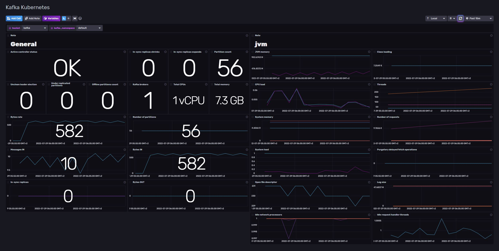

# Kafka Kubernetes Template

Provided by: [bonitoo.io](.)

Global Apache Kafka dashboard running on Kubernetes. Support Bitnami Kafka chart https://github.com/bitnami/charts/tree/master/bitnami/kafka

This Istio template can be used to monitor your Istio deployment with following dashboards:

Kafka Kubernetes Dashboard:


### Quick Install

#### InfluxDB UI

In the InfluxDB UI, go to Settings->Templates and enter this URL: https://raw.githubusercontent.com/influxdata/community-templates/master/kafka_kubernetes/kafka_kubernetes.yml

#### Influx CLI

If you have your InfluxDB credentials [configured in the CLI](https://v2.docs.influxdata.com/v2.0/reference/cli/influx/config/), you can install this template with:

```
influx apply -u https://raw.githubusercontent.com/influxdata/community-templates/master/kafka_kubernetes/kafka_kubernetes.yml
```

## Included Resources

- 1 Label: `kafka`
- 1 Telegraf Configuration: `Kafka Kubernetes`
- 1 Dashboard: `Kafka Kubernetes`
- 2 Variables: `bucket`, `kafka_namespace`

## Setup Instructions

General instructions on using InfluxDB Templates can be found in the [use a template](../docs/use_a_template.md) document.

### Requirements:

- Kubernetes 1.20+
- Apache Kafka (Apache Kafka, Jmx exporter, Kafka exporter, Zookeeper)
- InfluxData Telegraf with Prometheus input plugin

#### Apache Kafka:

- Apache Kafka helm chart: https://github.com/bitnami/charts/tree/master/bitnami/kafka

#### Telegraf:

Telegraf uses the Prometheus input plugin to scrape Prometheus metrics endpoints of Kafka service metrics API URLs.

The Telegraf configuration requires the following environment variables

- `INFLUX_HOST`
- `INFLUX_BUCKET`
- `INFLUX_TOKEN` - The token with the permissions to read Telegraf configs and write data to the `telegraf` bucket. You can just use your operator token to get started.
- `INFLUX_ORG` - The name of your Organization
- `KAFKA_NAMESPACE` - Namespace where monitored Kafka brokers is running on.

> Any specific configuration reflecting custom Kubernetes or Kafka deployment might require additional changes in Telegraf/Kafka configuration.

You **MUST** set these environment variables before running Telegraf using something similar to the following commands

- This can be found on the `Load Data` > `Tokens` page in your browser: `export INFLUX_TOKEN=TOKEN`
- Your Organization name can be found on the Settings page in your browser: `export INFLUX_ORG=my_org`

## Contact

- Email: tomas.klapka@bonitoo.io
