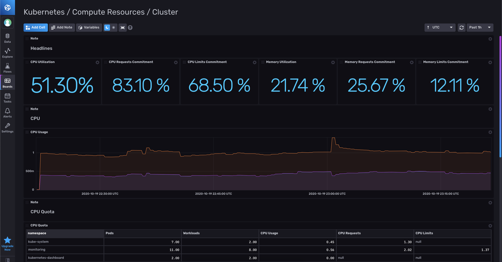

# Kube Prometheus Template

Provided by: Russ Savage

This template is meant to recreate the Grafana dashboards that are found in the [Kube Prometheus](https://github.com/prometheus-operator/kube-prometheus) project. Telegraf and InfluxDB Cloud replaces the Prometheus Server in that configuration.



### Quick Install

Note: This template assumes you are storing your prometheus data in a bucket called `kube_prometheus` and leveraging the prometheus metrics version 1 in the [Telegraf Prometheus Input plugin](https://github.com/influxdata/telegraf/tree/master/plugins/inputs/prometheus).

This plugin also includes an example `telegraf_config/values.yml` file which can be used with the [Telegraf Helm Chart](https://github.com/influxdata/helm-charts/tree/master/charts/telegraf) to configure Telegraf with the same scrape targets as Prometheus server. All you need to do is fill in your InfluxDB Cloud Credentials into that file and install it using the commands provided in the Telegraf helm chart readme (`-f values.yaml`).

#### InfluxDB UI

In the InfluxDB UI, go to Settings->Templates and enter this URL: https://raw.githubusercontent.com/influxdata/community-templates/master/kube_prometheus/kube_prometheus.yml

#### Influx CLI
If you have your InfluxDB credentials [configured in the CLI](https://docs.influxdata.com/influxdb/v2.0/reference/cli/influx/config/), you can install this template with:

```
influx apply -u https://raw.githubusercontent.com/influxdata/community-templates/master/kube_prometheus/kube_prometheus.yml
```

## Included Resources

  - 1 Label: `kube_prometheus`
  - 1 Dashboard: `Kubernetes / Compute Resources / Cluster`
  - 4 Tasks: Used to calculate custom metrics for the dashboard

## Setup Instructions

General instructions on using InfluxDB Templates can be found in the [use a template](../docs/use_a_template.md) document.

This InfluxDB Template assumes you are storing your prometheus data in a bucket called `kube_prometheus` and leveraging the prometheus metrics version 1 in the [Telegraf Prometheus Input plugin](https://github.com/influxdata/telegraf/tree/master/plugins/inputs/prometheus).

This plugin also includes an example `telegraf_config/values.yml` file which can be used with the [Telegraf Helm Chart](https://github.com/influxdata/helm-charts/tree/master/charts/telegraf) to configure Telegraf with the same scrape targets as Prometheus server. All you need to do is fill in your InfluxDB Cloud Credentials into that file and install it using the commands provided in the Telegraf helm chart readme and adding `-f values.yaml` to use your local values.

## Contact

Author: Russ Savage

Email: russ@influxdata.com

Github: @russorat

Influx Slack: @russ