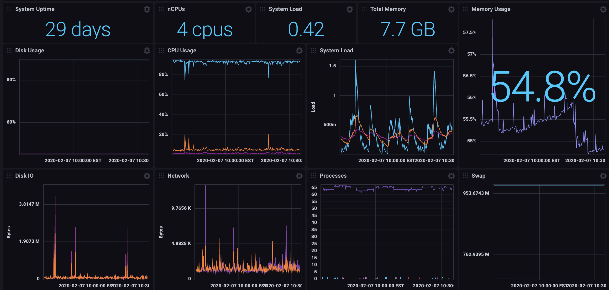
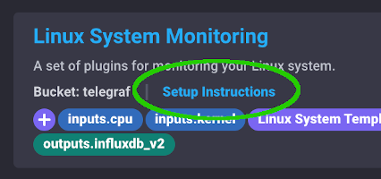

## Linux System Monitoring Template

This InfluxDB Template can be used to monitor your Linux System.

### Included Resources

- 1 Bucket: `telegraf`, 7d retention
- Labels: `Linux System Template` + Telegraf Plugin Labels
- 1 Telegraf Configuration
- 1 Dashboard: `Linux System`
- 2 Variables: `bucket` and `linux_host`

## Setup Instructions
    
  The data for the dashboard is populated by the included Telegraf configuration. The Telegraf Configuration requires the following environment variables
    
  - `INFLUX_TOKEN` - The token with the permissions to read Telegraf configs and write data to the `telegraf` bucket. You can just use your master token to get started.
  - `INFLUX_ORG` - The name of your Organization (this will be your email address on the InfluxDB Cloud free tier)
  - `INFLUX_HOST` - The URL of your InfluxDB host (this can your localhost, a remote instance, or InfluxDB Cloud)

  You **MUST** set these environment variables before running Telegraf using something similar to the following commands
    
  - This can be found on the `Load Data` > `Tokens` page in your browser: `export INFLUX_TOKEN=TOKEN`
  - Your Organization name can be found on the Settings page in your browser: `export INFLUX_ORG=my_org`

## Running Telegraf

  To get resource data from your Linux hosts, [download and install Telegraf](https://portal.influxdata.com/downloads/) on those hosts. InfluxData provides native packages for a number of distributions as well as binaries that can be executed directly.

  Start Telegraf using the instructions from the `Load Data` > `Telegraf` > `Setup Instructions` link in the UI.

## Customizations

You can run the provided Telegraf configuration on multiple Linux machines, and switch between them using the `linux_host` filter at the top of the dashboard.

## Contact

Provide a way for users to get in touch with you if they have questions or need help using your template. What information you give is up to you, but we encourage providing those below.

- Author: Russ Savage
- Email: russ@influxdata.com
- Github: [@russorat](https://github.com/russorat)
- Influx Slack: [@russ](https://influxdata.com/slack)