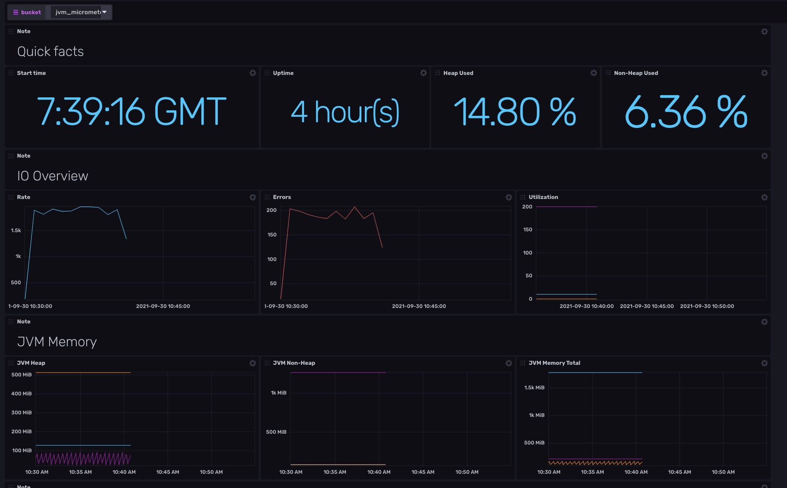
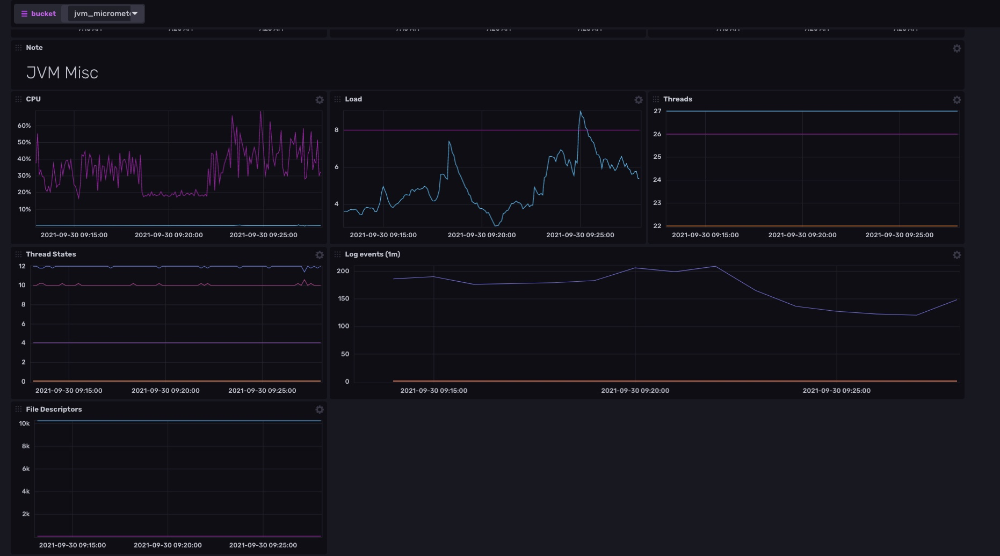
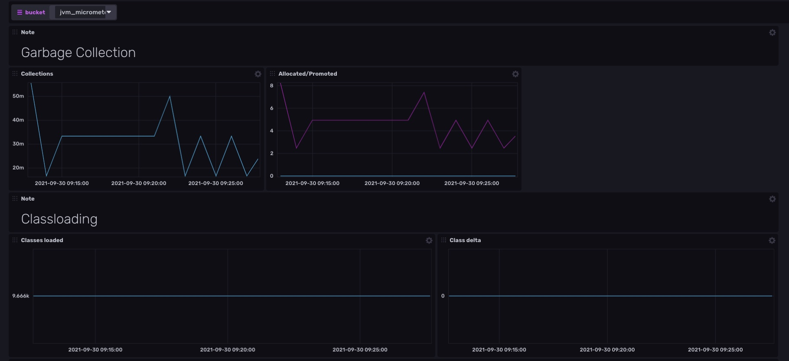
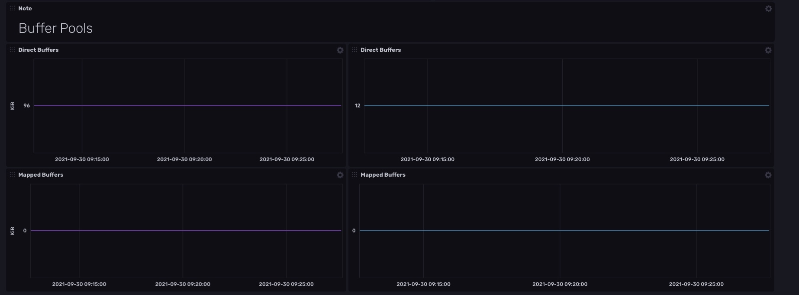

# Micrometer Template

Provided by: [bonitoo.io](.)

**This template provides Micrometer dashboard**

> Micrometer provides a simple facade over the instrumentation clients for the most popular monitoring systems, allowing you to instrument your JVM-based application code without vendor lock-in. Think SLF4J, but for metrics.

Using Micrometer Java application can be set up to send data to InfluxDB. The InfluxDB
dashboard provides beautiful visualizations of the collected results in time.






Micrometer metrics available in this dashboard:

- **Request count** - successful and failing
- **System load**
- **JVM Memory** - heap stats, thread count, garbage collection

### Quick Install

#### InfluxDB UI

In the InfluxDB UI, go to Settings->Templates and enter this URL: https://raw.githubusercontent.com/influxdata/community-templates/master/micrometer/micrometer.yml

#### Influx CLI

If you have your InfluxDB credentials [configured in the CLI](https://v2.docs.influxdata.com/v2.0/reference/cli/influx/config/), you can install this template with:

```
influx apply -u https://raw.githubusercontent.com/influxdata/community-templates/master/micrometer/micrometer.yml
```

## Included Resources

The template consists of the following:

- 1 Dashboard: `JVM Micrometer`
- 1 Variable: `bucket`

- Java project in the `sample` directory that can be used to generate sample data.

## Setup Instructions

General instructions on using InfluxDB Templates can be found in the [use a template](../docs/use_a_template.md) document.

**Import the template**

```
influx apply --file ./micrometer.yml
```

**Start with a sample data:**

> To generate sample data just configure and run Java project in sample directory.

**To start** with the sample project, follow these steps:

1. Install Java
1. Install InfluxDB 2.x on your localhost or sign up to Influx Cloud
1. Configure java application by editing `MetricsConfiguration.java`. Change following properties to proper values: `org`, `bucket`, `token` and `uri`.
1. Install dependencies using maven: `mvn install`
1. Run `./sample/scrips/requests.sh` to generate some traffic.

The dashboard should start presenting the results.

## Customizations

n/a

## Contact

Author: Tomas Vojtech, https://www.bonitoo.io

Github: @tvojtech
