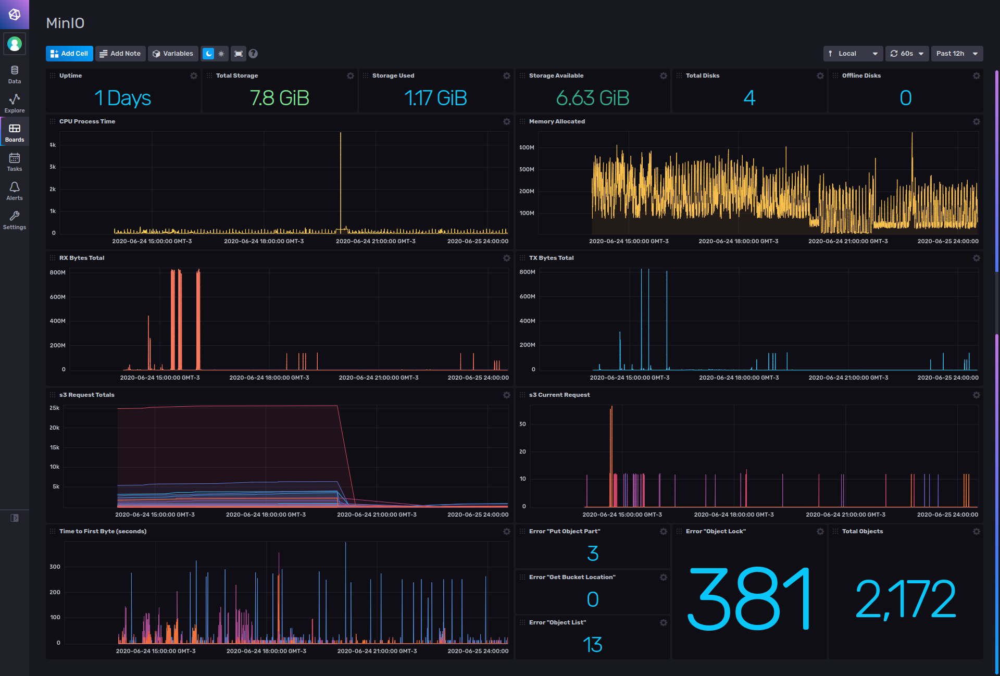

# MinIO monitoring for InfluxDB v2

Provided by: Ignacio Van Droogenbroeck

This template allows you to monitor your MinIO instance. The data you can watch is: Uptime, total storage, storage used, CPU process time, memory allocated, network rx and tx, s3 total and current request, among other data.



### Quick Install

#### InfluxDB UI

In the InfluxDB UI, go to Settings->Templates and enter this URL: https://raw.githubusercontent.com/influxdata/community-templates/master/minio/minio.yml

#### Influx CLI
If you have your InfluxDB credentials [configured in the CLI](https://v2.docs.influxdata.com/v2.0/reference/cli/influx/config/), you can install this template with:

```
influx apply -u https://raw.githubusercontent.com/influxdata/community-templates/master/minio/minio.yml
```

## Included Resources

    - 1 Dashboards: 'minio'
    - 1 Label: 'minio'
    - 1 Bucket: 'minio'

## Setup Instructions

General instructions on using InfluxDB Templates can be found in the [use a template](../docs/use_a_template.md) document.

In order to use this template, you need to specify an scraper and point to https://your-minio:9000/minio/prometheus/metrics and the bucket provided with this template.

You can found more information about how to set up an scraper [here](https://v2.docs.influxdata.com/v2.0/write-data/no-code/scrape-data/)  


## Contact

Author: Ignacio Van Droogenbroeck

Email: ignacio[at]vandroogenbroeck[dot]net

Github and Gitlab user: @xe-nvdk 

Influx Slack: Ignacio Van Droogenbroeck
