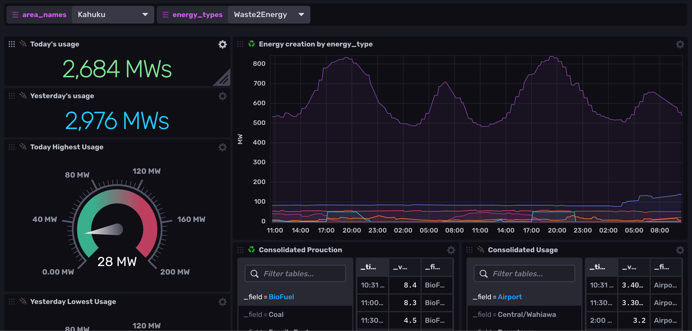

## Island Pulse Monitoring Template

This InfluxDB Template can be used to gather data from a Modbus slave

The goal of this template is to provide an example of using Telgraf's Modbus input plugin to gather information from a device then insert it into infux for storage and processing.




### Quick Install

#### InfluxDB UI

In the InfluxDB UI, go to Settings->Templates and enter this URL: https://raw.githubusercontent.com/influxdata/community-templates/master/modbus/modbus.yml

#### Influx CLI
If you have your InfluxDB credentials [configured in the CLI](https://v2.docs.influxdata.com/v2.0/reference/cli/influx/config/), you can install this template with:

```
influx apply -u https://raw.githubusercontent.com/influxdata/community-templates/master/modbus/modbus.yml
```

### Included Resources

- 1 label: `island_pulse`
- 1 bucket: 'node8'
- 9 Alerts: Threshold checks for all areas in `area_names`
- 2 Variables: `area_names`, `energy_types`
- 1 Dashboard: `Island Pulse`  (see screenshot above)

## Setup Instructions

General instructions on using InfluxDB Templates can be found in the [use a template](../docs/use_a_template.md) document.

The data for the dashboard is populated by communicating to a modbus device. You may refer to the [Island Pulse Demo Modbus Device](https://github.com/sgnl/islandpulse_demo_modbus_device) repository for a working demo device you can use while you explore this template.

Telegraf Configuration requires the following environment variables:

- `INFLUX_HOST`
- `INFLUX_TOKEN`
- `INFLUX_ORG`

## Contact

- Author: Ray Farias
- Email: ray@sudokrew.com
- Github: [@sgnl](https://github.com/sgnl)
- Influx Slack: [@Ray Farias](https://influxdata.com/slack)