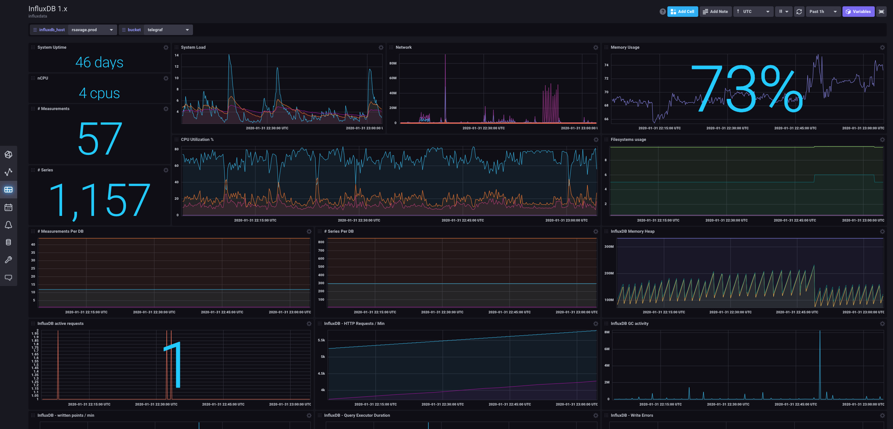

# InfluxDB 1.x Open Source Monitoring Template

Provided by: InfluxData

This InfluxDB Template can be used to monitor your already running InfluxDB 1.x instance. It provides a quick way to get started on InfluxDB 2.0 if you are an existing InfluxDB user.

## Included Resources

  - 1 Bucket: `Telegraf`, 7d retention
  - 3 Labels: `InfluxDB1.x`,`Solution`,`Telegraf`
  - 1 Telegraf Configuration: `InfluxDB_1.x.conf`
  - 3 Checks: `Disk Usage Check`, `Host Deadman`, and `Memory Usage Check`
  - 2 Dashboards: `InfluxDB 1.x` and `Telegraf`
  - 3 Variables: `bucket`, `influxdb_host`, and `telegraf_host`

## Setup Instructions
    
  General instructions on using InfluxDB Templates can be found in the [use a template](../docs/use_a_template.md) document.
  
  The data for the dashboard is populated by the included Telegraf configuration. The Telegraf Configuration requires the following environment variables
    
  - `INFLUX_TOKEN` - The token with the permissions to read Telegraf configs and write data to the `telegraf` bucket. You can just use your master token to get started.
  - `INFLUX_ORG` - The name of your Organization
  - `INFLUX_HOST` - The URL of your InfluxDB host (this can your localhost, a remote instance, or InfluxDB Cloud)

  You **MUST** set these environment variables before running Telegraf using something similar to the following commands
    
  - This can be found on the `Load Data` > `Tokens` page in your browser: `export INFLUX_TOKEN=TOKEN`
  - Your Organization name can be found on the Settings page in your browser: `export INFLUX_ORG=my_org`

  You can start Telegraf using the instructions from the `Telegraf` > `Setup Instructions` link in the UI.

## Customizations
You can easily update the Telegraf configurations to point to a specific InfluxDB 1.x location by setting the options in the [InfluxDB Input](https://github.com/influxdata/telegraf/tree/master/plugins/inputs/influxdb) or the [InfluxDB 2.0 Output](https://github.com/influxdata/telegraf/tree/master/plugins/outputs/influxdb_v2). 

## Contact

- Author: Russ Savage
- Email: russ@influxdata.com
- Github: [@russorat](https://github.com/russorat)
- Influx Slack: [@russ](https://influxdata.com/slack)
