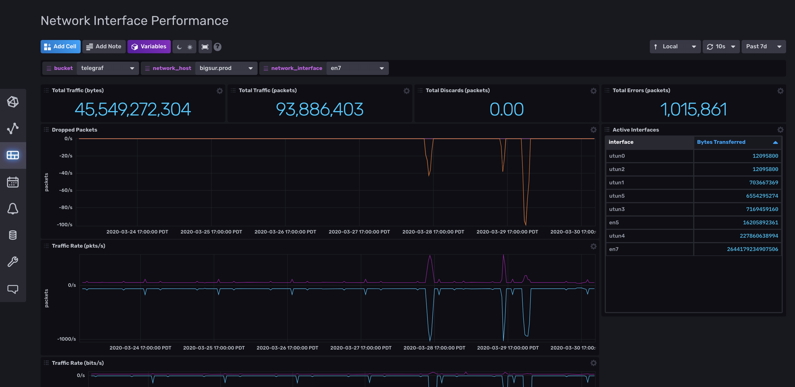

# Network Interface Performance Template

Provided by: InfluxData

This InfluxDB Template can be used to monitor your network traffic across multiple hosts.

## Included Resources

  - 1 Bucket: `network_data`, 7d retention
  - 1 Telegraf Configuration: `network-data.conf`
  - 1 Dashboard: `Network Interface Performance`
  - 2 Labels: `outputs.influxdb_v2`, `inputs.net`

## Setup Instructions
    
  The data for the dashboard is populated by the included Telegraf configuration. The Telegraf Configuration requires the following environment variables
    
  - `INFLUX_TOKEN` - The token with the permissions to read Telegraf configs and write data to the `telegraf` bucket. You can just use your master token to get started.
  - `INFLUX_ORG` - The name of your Organization (this will be your email address on the InfluxDB Cloud free tier)
  - `INFLUX_URL` - The URL of your InfluxDB host (this can your localhost, a remote instance, or InfluxDB Cloud)

  You **MUST** set these environment variables before running Telegraf using something similar to the following commands
    
  - This can be found on the `Load Data` > `Tokens` page in your browser: `export INFLUX_TOKEN=TOKEN`
  - Your Organization name can be found on the Settings page in your browser: `export INFLUX_ORG=my_org`

  You can start Telegraf using the instructions from the `Telegraf` > `Setup Instructions` link in the UI.

## Customizations

You can run the provided Telegraf configuration on multiple machines, and switch between them using the `network_host` filter at the top of the dashboard.

## Contact

- Author: Russ Savage
- Email: russ@influxdata.com
- Github: [@russorat](https://github.com/russorat)
- Influx Slack: [@russ](https://influxdata.com/slack)
