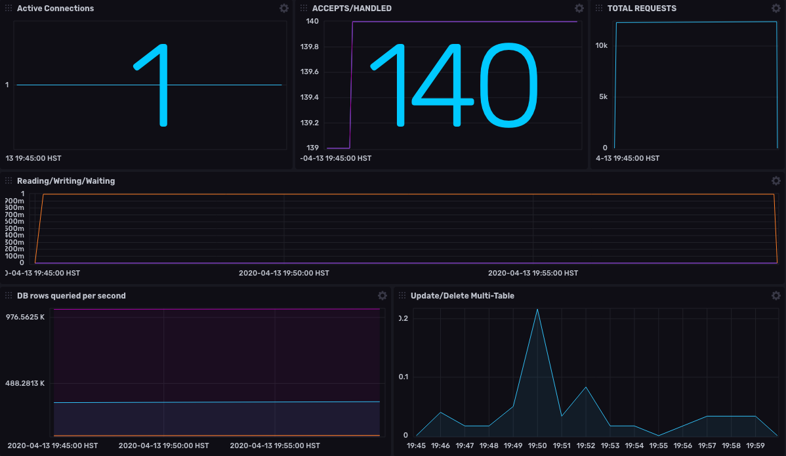

## NGINX & MySQL Monitoring Template

This InfluxDB Template can be used to monitor a website running on NGINX and MySQL



### Quick Install

If you have your InfluxDB credentials [configured in the CLI](Vhttps://v2.docs.influxdata.com/v2.0/reference/cli/influx/config/), you can install this template with:

```
influx pkg -u https://raw.githubusercontent.com/influxdata/community-templates/master/nginx_mysql/nginx_mysql.yml
```

### Included Resources

- `NGINX + MySQL` Dashboard (see screenshot above)
- Telegraf configuration for `nginx` and `mysql`
- Bucket variables for `mysqlBucket` and `nginxBucket`. You will need to update the value for these thru the InfluxDB UI `Settings` > `Variables` after you've installed this dashboard template
- Labels: `nginx` and `mysql`

## Setup Instructions

General instructions on using InfluxDB Templates can be found in the [use a template](../docs/use_a_template.md) document.

### NGINX

In order to collect information from your NGINX server, you will need:

- NGINX compiled with `ngx_http_stub_status_module` module. [Module documentation here](https://nginx.org/libxslt/en/docs/http/ngx_http_stub_status_module.html)
- `url` location for your `stub_status` e.g. "{{nginx_url}}/basic_status" when configured with:

  ```
  location = /basic_status {
      stub_status;
  }
  ```

### MySQL

In order to collect information form your MySQL database you will need:
- `username` for an authorized user with READ access at the very least
- `password`
- `address` address of your MySQL instance(s)

### Telegraf
  The data for the dashboard is populated by the included Telegraf NGINX and MySQL configurations. The Configuration requires the following environment variables

  - `INFLUX_TOKEN` - The token with the permissions to read Telegraf configs and write data to the `telegraf` bucket. You can just use your master token to get started.
  - `INFLUX_ORG` - The name of your Organization (this will be your email address on the InfluxDB Cloud free tier)
  - `INFLUX_HOST` - The URL of your InfluxDB host (this can your localhost, a remote instance, or InfluxDB Cloud)
  - `NGINX_STATUS_URL` - The URL where your server status reports are served from
  - `MYSQL_USERNAME`
  - `MYSQL_PASSWORD`
  - `MYSQL_ADDRESS`

  You **MUST** set these environment variables before running Telegraf using something similar to the following commands

  - This can be found on the `Load Data` > `Tokens` page in your browser: `export INFLUX_TOKEN=TOKEN`
  - Your Organization name can be found on the Settings page in your browser: `export INFLUX_ORG=my_org`

## Customizations

Be sure to update the values for these variables: `mysqlBucket`, `nginxBucket`, `NGINX_STATUS_URL`, `MYSQL_USERNAME`, `MYSQL_PASSWORD`, and `MYSQL_ADDRESS`
## Contact

- Author: Ray Farias
- Email: ray@sudokrew.com
- Github: [@sgnl](https://github.com/sgnl)
- Influx Slack: [@Ray Farias](https://influxdata.com/slack)