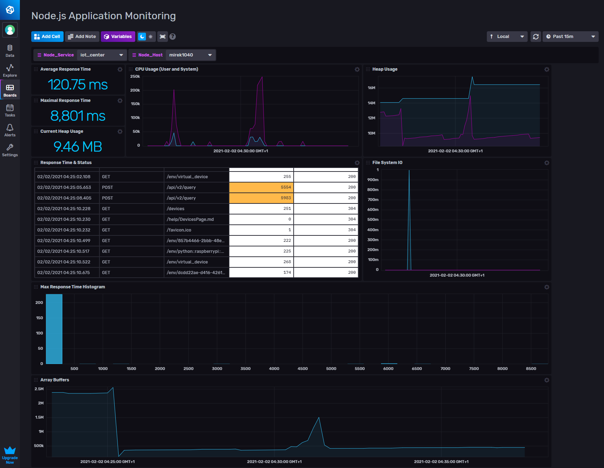

# Node.js Monitoring Template

Provided by: [bonitoo.io](.)

This template provides a simple monitoring of Node.js application. Dashboard is showing basic process metrics and response time of http requests including response code.
The process metrics are generated from `process.memoryUsage()))`, `process.cpuUsage()` and `process.resourceUsage()` functions.
  
### Dashboard example



### Quick Install

#### InfluxDB UI

In the InfluxDB UI, go to Settings->Templates and enter this URL: https://github.com/influxdata/community-templates/tree/master/Node.js/Node.js.yml

#### Influx CLI
If you have your InfluxDB credentials [configured in the CLI](https://v2.docs.influxdata.com/v2.0/reference/cli/influx/config/), you can install this template with:

```
influx apply https://github.com/influxdata/community-templates/tree/master/Node.js/Node.js.yml
```

## Included Resources

This template includes the following:

  - 1 Bucket: `iot_center`
  - 1 Label: `Node.js`
  - 1 Dashboards: `Node.js Application Monitoring`
  - 2 Variables: `Node_Service`, and `Node_Host`

## Setup Instructions

1. Load the dashboard according to the the paragraph above
1. Copy [monitor.js](https://github.com/influxdata/community-templates/tree/master/Node.js/monitor.js) and [env.js](https://github.com/influxdata/community-templates/tree/master/Node.js/env.js) files
1. Update InfluxDB credentials in `env.js`
1. Register `monitor.js` code - see the following example

```javascript
const onboardInfluxDB = require('./influxdb/onboarding')
const {logEnvironment, INFLUX_URL} = require('./env')
const monitor = require('./monitor')

async function startApplication() {
  const app = express()

  // monitor application
  monitor(app)

  ...
}
```

## Contact

Author: Miroslav Malecha, https://www.bonitoo.io
