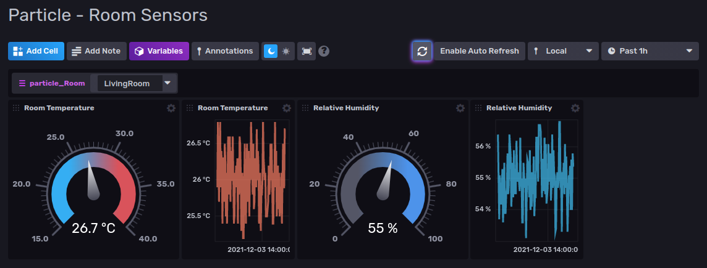

# Particle Template

Provided by: [bonitoo.io](.)

**Sample dashboard displaying data published by [Particle](https://www.particle.io/) IoT devices.**

This template provides a sample dashboard displaying data published by [Particle](https://www.particle.io/) IoT devices
in a Home Automation System and a Telegraf configuration file to integrate with [Particle](https://www.particle.io/).

Particle + Influxdata integration is described in more detail in the following document:
https://docs.particle.io/tutorials/integrations/influxdata/.



### Quick install

#### InfluxDB UI

In the InfluxDB UI, go to Settings->Templates and enter this URL:
https://raw.githubusercontent.com/influxdata/community-templates/master/particle/particle.yml

#### Influx CLI

If you have your InfluxDB
credentials [configured in the CLI](https://v2.docs.influxdata.com/v2.0/reference/cli/influx/config/), you can install
this template with:

```
influx apply -u https://raw.githubusercontent.com/influxdata/community-templates/master/particle/particle.yml
```

## Included Resources

This template includes the following:

- 1 Label: `Particle`
- 1 Dashboard: `Particle - Room Sensors`
- 1 Variable: `particle_Room`
- 1 Telegraf Configuration: `Particle`

## Setup Instructions

1. **Create bucket `telegraf`** (if it does not exist yet)
    * this template is configured to use bucket `telegraf`

2. **Setup Telegraf** using the configuration included in this template
    * environment variables to be set are described in section [Telegraf Configuration](#TelegrafConfiguration) below

3. **Configure a Webhook on the [Particle console](https://console.particle.io/integrations)** pointing to your running
   Telegraf host
    * follow section [Particle Console](https://docs.particle.io/tutorials/integrations/influxdata/#particle-console) on
      particle.io
    * make sure that the URL ends with `/particle`
    * use the following custom JSON data:
      ```
      {
        "event": "{{{PARTICLE_EVENT_NAME}}}",
        "data": {{{PARTICLE_EVENT_VALUE}}},
        "published_at": "{{{PARTICLE_PUBLISHED_AT}}}",
        "measurement": "particle"
      }
      ```

4. **Modify your Particle IoT devices' firmware** to publish events
    * follow section [Firmware](https://docs.particle.io/tutorials/integrations/influxdata/#firmware) on particle.io
    * use method `Particle.publish()` to publish events from the IoT devices
    * the sample dashboard in this template uses fields `temp_c` and `humidity` and tag `room`
    * sample event data to send from the IoT device:
      ```
      {
        "tags": {
          "room": "Kitchen"
        },
        "values": {
          "temp_c": 25.3,
          "humidity": 65
        }
      }
      ```

### <a name="TelegrafConfiguration"></a>Telegraf Configuration

The Telegraf configuration requires the following environment variables to be defined:

- `INFLUX_HOST` - The URL for your InfluxDB host.
- `INFLUX_TOKEN` - The token with the permissions to read Telegraf configs and write data to the `telegraf` bucket. You
  can just use your operator token to get started.
- `INFLUX_ORG` - The name of your organization in InfluxDB.

You **MUST** set these environment variables before running Telegraf using something similar to the following commands

- This can be found on the `Load Data` > `Tokens` page in your browser: `export INFLUX_TOKEN=TOKEN`
- Your Organization name can be found on the Settings page in your browser: `export INFLUX_ORG=my_org`

## Contact

Author: Jan Simon, https://www.bonitoo.io

Github: @jansimonb
