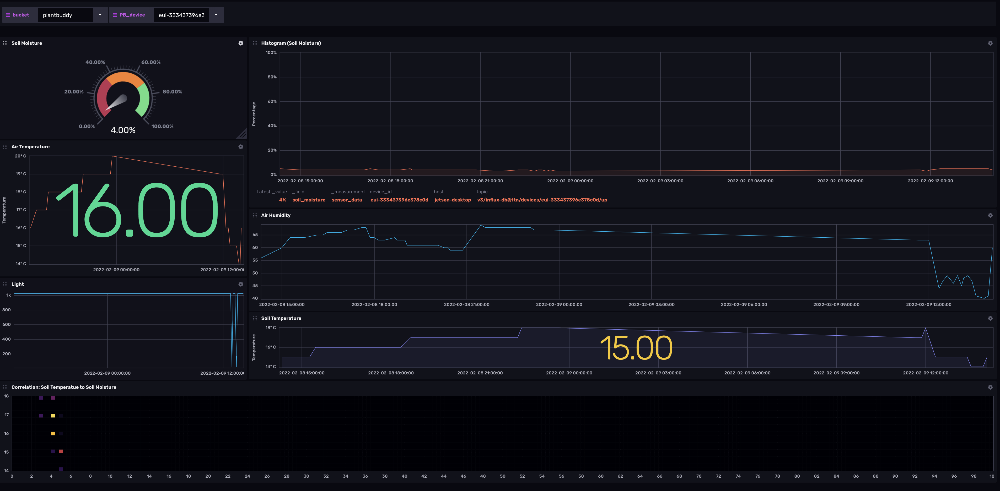

# Plant_Buddy

Provided by: Jay Clifford

This collection of InfluxDB Template can be used to; collect, store, visualize and downsample data from your Plant Buddy device. 

The goal of this template is to provide health stats on your chosen plant. This template monitors the following assets:
- Air Temperature
- Air Humidity
- Soil Temperature
- Soil Moisture
- Light

Plant Buddy has been ported to several embedded controllers. In most cases the templates are equivlent it seemed it fit to provide each device its own template.


##### Dashboard examples



### Quick Install

#### InfluxDB UI

In the InfluxDB UI, go to Settings->Templates and enter this URL: 
| Device               | Protocol    | link |
|----------------------|-------------|:-------------------------:|
| [Arduino MKR WAN 1310](https://store.arduino.cc/products/arduino-mkr-wan-1310) | LoRaWAN| https://raw.githubusercontent.com/influxdata/community-templates/master/plant_buddy/plant_buddy_TN.yml |

#### Influx CLI
If you have your InfluxDB credentials [configured in the CLI](https://v2.docs.influxdata.com/v2.0/reference/cli/influx/config/), you can install this template with:

```
influx apply -u https://raw.githubusercontent.com/influxdata/community-templates/master/plant_buddy/<template_name>.yml
```

## Included Resources
  - 2 Bucket: `plantbuddy` and `downsampled`, 2d, 30d retention
  - 1 Telegraf Configuration
  - 1 Dashboards: `Plant Buddy`
  - 2 Variables: `bucket` and `PB_device`
  - 1 Task: `PB_downsample`

## Setup Instructions

General instructions on using InfluxDB Templates can be found in the [use a template](../docs/use_a_template.md) document.

For information about the Plant Buddy project, check out this repo [here](https://github.com/InfluxCommunity/plant_buddy)

## Customizations
Plant Buddy has been ported to several embedded controllers. In most cases the templates are equivlent it seemed it fit to provide each device its own template. It is worth noting that the templates could be modified with extended meta data like: user ID, location and plant type. 


## Contact

Author: Jay Clifford

Email: [jclifford@influxdata.com](mailto:jclifford@influxdata.com)

Github: [@Jayclifford345](https://github.com/Jayclifford345)

Influx Slack: [Jay Clifford](https://influxcommunity.slack.com/team/U02E8MP82SW)