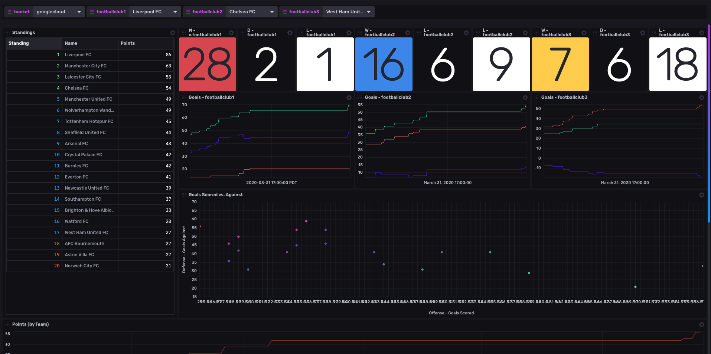

# English Premier League Template

Provided by: Samantha Wang

This templates provides a view of the English Premier League team statistics from [SportsDataIO](https://sportsdata.io). The data for this template only has statistics from the free version of SportDataIO's [soccer API](https://sportsdata.io/developers/api-documentation/soccer#/free). 




### Quick Install

If you have your InfluxDB credentials [configured in the CLI](Vhttps://v2.docs.influxdata.com/v2.0/reference/cli/influx/config/), you can install this template with:

```
influx pkg -u https://raw.githubusercontent.com/influxdata/community-templates/master/premier_league/premier_league.yml
```

## Included Resources

- 1 Bucket: `telegraf`
- 1 Labels: `EPL`
- 1 Telegraf Configuration: `premier_league.conf`
- 1 Dashboards: `Premier League`
- 3 Variables: `footballclub1`, `footballclub2`, `footballclub3`

## Setup Instructions
1. Sign up and subscribe to a [free trial of SportsDataIO's API](https://sportsdata.io/cart/free-trial). Select "Soccer" as the sport.
2. From the [SportsDataIO developer portal](https://sportsdata.io/developers/api-documentation/soccer) retrieve your API key for for your soccer subscription. Save the key as an environment variable `SPORTSDATAIO_SOCCER_API_KEY` as it will be used for in the Telegraf configuration file.
3. Follow the rest of the general instructions on using InfluxDB Templates can be found in the [use a template](../docs/use_a_template.md) document.

    
Telegraf Configuration requires the following environment variables
- `INFLUX_TOKEN` - The token with the permissions to read Telegraf configs and write data to the `telegraf` bucket. You can just use your master token to get started.
- `INFLUX_ORG` - The name of your Organization
- `INFLUX_HOST` - The URL of the InfluxDB cluster nodes (ex for AWS West: https://us-west-2-1.aws.cloud2.influxdata.com/)
- `SPORTSDATAIO_SOCCER_API_KEY` - SportsDataIO Soccer API Key

You **MUST** set these environment variables before running Telegraf using something similar to the following commands
    - This can be found on the `Load Data` > `Tokens` page in your browser: `export INFLUX_TOKEN=TOKEN`
    - Your Organization name can be found on the Settings page in your browser: `export INFLUX_ORG=my_org`

## Customizations

This template displays data only from SportDataIO's Premier League standings data set. You can add more data and visualizations to your dashboards with other data sets (players, teams) including getting more data access with a with a paid subscription.  You would need to edit your Telegraf input plugin configuration if you add other metrics.  Follow the guidelines of the [HTTP input plugin](https://github.com/influxdata/telegraf/tree/master/plugins/inputs/http) and [JSON parser](https://github.com/influxdata/telegraf/tree/master/plugins/parsers/json) to properly ingest your data. 

There are 3 variables included in this template that allows you to view wins, losses, draws and a time series graph on goals for three football clubs.  Other club statistics can be added to the dashboard using the variable name.  You can also add another variable (ex: `v.footballclub4`) to add another club view to your dashboard. 

## Contact

Author: Samantha Wang

Email: swang@influxdata.com

Github: @sjwang90

Influx Slack: @Samantha Wang
