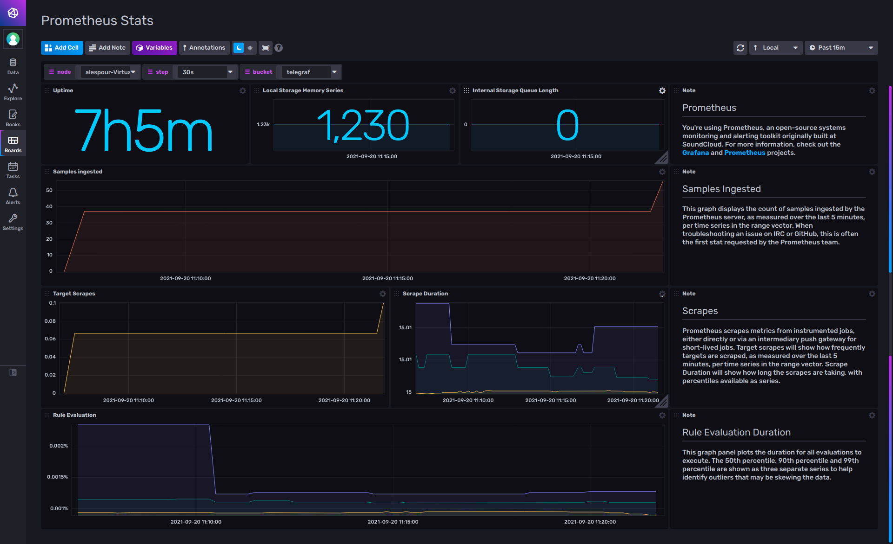
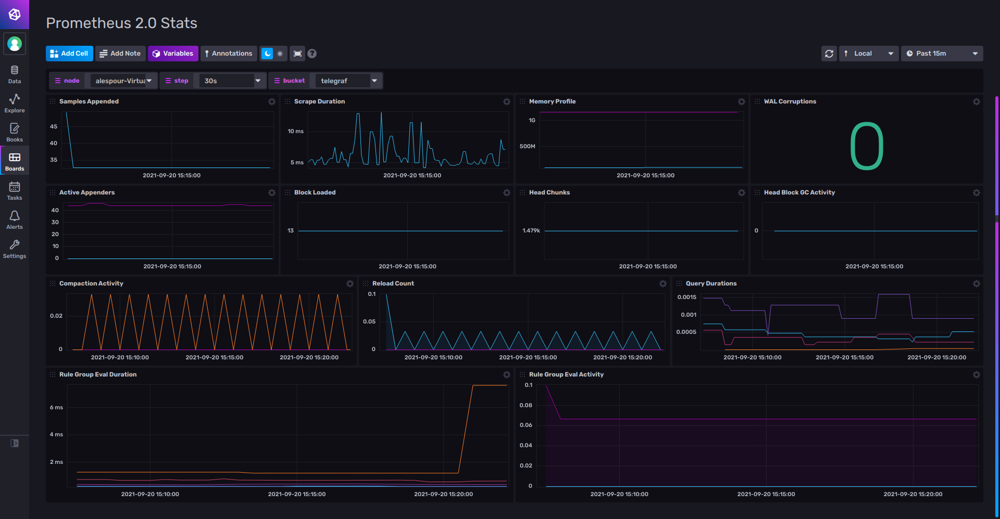

# Prometheus Monitoring

Provided by: [bonitoo.io](.)

The template provides simple dashboard for Prometheus 1.x and detailed dashboard for Prometheus 2.x

##### Dashboard examples





### Quick install

#### InfluxDB UI

In the InfluxDB UI, go to Settings->Templates and enter this URL: https://raw.githubusercontent.com/influxdata/community-templates/master/prometheus/prometheus.yml

#### Influx CLI

If you have your InfluxDB credentials [configured in the CLI](https://v2.docs.influxdata.com/v2.0/reference/cli/influx/config/), you can install this template with:

```
influx apply -f https://raw.githubusercontent.com/influxdata/community-templates/master/prometheus/prometheus.yml
```

## Included resources

This template includes the following:

- 3 Variables: `bucket`, `host`, `step`
- 2 Dashboards: `Prometheus Stats`, `Prometheus 2.0 Stats`
- 1 Telegraf Configuration: `Prometheus`

## Setup Instructions

Load the dashboards and setup your Telegraf instance to use the [Prometheus plugin](https://github.com/influxdata/telegraf/tree/master/plugins/inputs/prometheus)
with the provided configuration.

## Contact

- Email: ales.pour@bonitoo.io
- Influx Slack: [@alespour](https://influxdata.com/slack)
