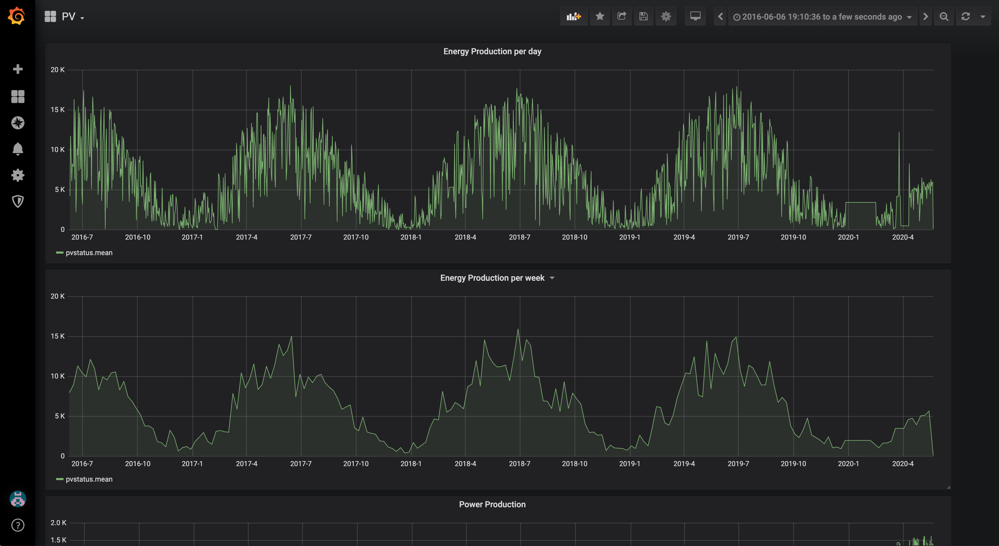

# PV Output dashboard (solar panel data)

Provided by: [Peter Peerdeman](https://peterpeerdeman.nl)

This dashboard shows solar panel data that is collected through a nodejs datalogger capturing data from pvoutput.org

## Included Resources

- 1 PV Output dashboard json export for Grafana 6.7.3

## Setup Instructions

General instructions on using InfluxDB Templates can be found in the [use a template](../docs/use_a_template.md) document.

### Data collection with RaspLogger (pv module)

RaspLogger PV module requires the following environment variables
- `PVOUTPUT_APIKEY` - The API key acquired at pvoutput.org website
- `PVOUTPUT_SYSTEMID` - The PV system id you want the logger to capture

Continuously monitor pvoutput data by using RaspLogger to log data
- `git checkout git@github.com:peterpeerdeman/rasplogger.git`
- `cd rasplogger`
- `docker run -it --rm --name rasplogger_pv -v "$PWD":/usr/src/app -w /usr/src/app --restart always node:13-buster node rasplogger.js cron pv "*/5 * * * *" -u http://influxdb:8086/pv`

### migrating data / example data

If you want to import historical data from a pv installation, or experiment with some sample pv data you can use [pvoutput-to-influx](https://github.com/peterpeerdeman/pvoutput-to-influx) on github

## Contact

- Author: Peter Peerdeman
- Email: peter@peterpeerdeman.nl
- Github: [@peterpeerdeman](https://github.com/peterpeerdeman)
- Influx Slack: [@Peter Peerdeman](https://influxdata.com/slack)
